# オンライン<ruby>原稿用紙<rt>げんこうようし</rt></ruby> Pro つかいかた

## はじめに ― このアプリで できること

このページは、オンライン<ruby>原稿用紙<rt>げんこうようし</rt></ruby> Pro を はじめて <ruby>開<rt>ひら</rt></ruby>く人のための つかいかたです。<ruby>画面<rt>がめん</rt></ruby>の <ruby>写真<rt>しゃしん</rt></ruby>と <ruby>見<rt>み</rt></ruby>くらべながら、<ruby>上<rt>うえ</rt></ruby>から じゅんに <ruby>読<rt>よ</rt></ruby>んでください。<ruby>後半<rt>こうはん</rt></ruby>には、先生だけが つかう <ruby>画面<rt>がめん</rt></ruby>の <ruby>説明<rt>せつめい</rt></ruby>も あります。

### <ruby>打<rt>う</rt></ruby>った <ruby>文<rt>ぶん</rt></ruby>が、その <ruby>場<rt>ば</rt></ruby>で たての <ruby>原稿用紙<rt>げんこうようし</rt></ruby>に なる

<ruby>左<rt>ひだり</rt></ruby>がわの <ruby>入力<rt>にゅうりょく</rt></ruby>らんに よこ<ruby>書<rt>が</rt></ruby>きで <ruby>打<rt>う</rt></ruby>つと、<ruby>右<rt>みぎ</rt></ruby>がわに たて<ruby>書<rt>が</rt></ruby>きの <ruby>原稿用紙<rt>げんこうようし</rt></ruby>が その <ruby>場<rt>ば</rt></ruby>で <ruby>組<rt>く</rt></ruby>み<ruby>上<rt>あ</rt></ruby>がります。<ruby>題名<rt>だいめい</rt></ruby>を <ruby>書<rt>か</rt></ruby>きはじめる <ruby>位置<rt>いち</rt></ruby>も、<ruby>名前<rt>なまえ</rt></ruby>の <ruby>入<rt>はい</rt></ruby>る <ruby>行<rt>ぎょう</rt></ruby>も、<ruby>行<rt>ぎょう</rt></ruby>の <ruby>先頭<rt>せんとう</rt></ruby>に <ruby>来<rt>き</rt></ruby>てはいけない <ruby>文字<rt>もじ</rt></ruby>の <ruby>送<rt>おく</rt></ruby>りも、ぜんぶ アプリが やります。

<ruby>書<rt>か</rt></ruby>けた <ruby>作文<rt>さくぶん</rt></ruby>は、先生が <ruby>教<rt>おし</rt></ruby>えてくれる 10<ruby>文字<rt>もじ</rt></ruby>の あいことばを <ruby>入<rt>い</rt></ruby>れるだけで <ruby>提出<rt>ていしゅつ</rt></ruby>できます。<ruby>名簿<rt>めいぼ</rt></ruby>の ファイルも、ID や パスワードも いりません。先生は <ruby>原稿用紙<rt>げんこうようし</rt></ruby>の <ruby>上<rt>うえ</rt></ruby>を なぞって <ruby>赤<rt>あか</rt></ruby>ペンを <ruby>入<rt>い</rt></ruby>れ、その <ruby>場<rt>ば</rt></ruby>で <ruby>返<rt>かえ</rt></ruby>してくれます。<ruby>印刷<rt>いんさつ</rt></ruby>すると、A4 の <ruby>紙<rt>かみ</rt></ruby>に <ruby>見開<rt>みひら</rt></ruby>き 2 <ruby>面<rt>めん</rt></ruby>の <ruby>原稿用紙<rt>げんこうようし</rt></ruby>が <ruby>出<rt>で</rt></ruby>てきます。

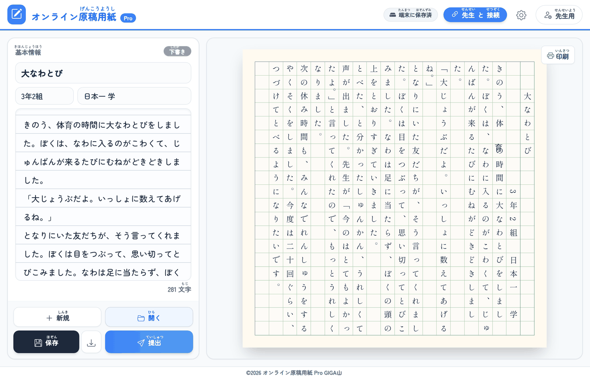

<ruby>左<rt>ひだり</rt></ruby>で <ruby>打<rt>う</rt></ruby>つと、<ruby>右<rt>みぎ</rt></ruby>が すぐ かわります。

### このアプリで できないこと

さきに <ruby>書<rt>か</rt></ruby>いておきます。できないことが <ruby>分<rt>わ</rt></ruby>かっていると、こまったときに <ruby>自分<rt>じぶん</rt></ruby>を うたがわずに すみます。

- <ruby>作文<rt>さくぶん</rt></ruby>は インターネットの <ruby>先<rt>さき</rt></ruby>には <ruby>保存<rt>ほぞん</rt></ruby>されません。いま つかっている <ruby>端末<rt>たんまつ</rt></ruby>の <ruby>中<rt>なか</rt></ruby>だけに <ruby>入<rt>はい</rt></ruby>ります。<ruby>別<rt>べつ</rt></ruby>の <ruby>端末<rt>たんまつ</rt></ruby>で <ruby>開<rt>ひら</rt></ruby>いても つづきは <ruby>出<rt>で</rt></ruby>てきません
- 先生が この アプリを <ruby>開<rt>ひら</rt></ruby>いていない あいだは、<ruby>提出<rt>ていしゅつ</rt></ruby>できません
- クラス <ruby>全体<rt>ぜんたい</rt></ruby>の <ruby>記録<rt>きろく</rt></ruby>を あつめて <ruby>数<rt>かぞ</rt></ruby>える しくみは ありません。<ruby>作文<rt>さくぶん</rt></ruby>を <ruby>書<rt>か</rt></ruby>いて、<ruby>直<rt>なお</rt></ruby>して、<ruby>返<rt>かえ</rt></ruby>してもらう ところまでの <ruby>道具<rt>どうぐ</rt></ruby>です

<ruby>書<rt>か</rt></ruby>いた ものが <ruby>消<rt>き</rt></ruby>えないように する <ruby>方法<rt>ほうほう</rt></ruby>は、あとの「<ruby>作文<rt>さくぶん</rt></ruby>が どこに <ruby>保存<rt>ほぞん</rt></ruby>されるか」の <ruby>章<rt>しょう</rt></ruby>に <ruby>書<rt>か</rt></ruby>いて あります。

### この つかいかたを どこから <ruby>読<rt>よ</rt></ruby>むか

この ページは、はじめから じゅんに <ruby>読<rt>よ</rt></ruby>めば <ruby>一通<rt>ひととお</rt></ruby>り つかえるように ならんで います。いそいで いる ときは、<ruby>次<rt>つぎ</rt></ruby>の めやすで えらんでください。

- <ruby>作文<rt>さくぶん</rt></ruby>を <ruby>書<rt>か</rt></ruby>いて <ruby>出<rt>だ</rt></ruby>す <ruby>人<rt>ひと</rt></ruby>（<ruby>児童<rt>じどう</rt></ruby>）… はじめの ほうの <ruby>章<rt>しょう</rt></ruby>を <ruby>読<rt>よ</rt></ruby>んでください。「ホーム<ruby>画面<rt>がめん</rt></ruby>に <ruby>入<rt>い</rt></ruby>れて」までで <ruby>一通<rt>ひととお</rt></ruby>り つかえます
- <ruby>受<rt>う</rt></ruby>け<ruby>取<rt>と</rt></ruby>って <ruby>添削<rt>てんさく</rt></ruby>する <ruby>人<rt>ひと</rt></ruby>（<ruby>先生<rt>せんせい</rt></ruby>）… <ruby>章<rt>しょう</rt></ruby>の <ruby>名前<rt>なまえ</rt></ruby>に「（<ruby>先生<rt>せんせい</rt></ruby><ruby>向<rt>む</rt></ruby>け）」と ついた ところを <ruby>読<rt>よ</rt></ruby>んでください
- <ruby>両方<rt>りょうほう</rt></ruby>に <ruby>関係<rt>かんけい</rt></ruby>する <ruby>話<rt>はなし</rt></ruby>… おわりの 3 つの <ruby>章<rt>しょう</rt></ruby>（ファイルでの やりとり、<ruby>保存<rt>ほぞん</rt></ruby>される <ruby>場所<rt>ばしょ</rt></ruby>、うまく いかない とき）に まとめて あります

<ruby>同<rt>おな</rt></ruby>じ アプリを <ruby>児童<rt>じどう</rt></ruby>も <ruby>先生<rt>せんせい</rt></ruby>も <ruby>使<rt>つか</rt></ruby>います。<ruby>右上<rt>みぎうえ</rt></ruby>の「<ruby>先生用<rt>せんせいよう</rt></ruby>」を おすと <ruby>先生<rt>せんせい</rt></ruby>の <ruby>画面<rt>がめん</rt></ruby>に かわり、<ruby>左上<rt>ひだりうえ</rt></ruby>の アプリの <ruby>名前<rt>なまえ</rt></ruby>を おすと もどります。<ruby>先生<rt>せんせい</rt></ruby>の <ruby>画面<rt>がめん</rt></ruby>では、ヘッダーの <ruby>下線<rt>かせん</rt></ruby>が <ruby>青<rt>あお</rt></ruby>から <ruby>赤<rt>あか</rt></ruby>に かわります。

## さいしょに よういするもの と、<ruby>開<rt>ひら</rt></ruby>いた ときの <ruby>画面<rt>がめん</rt></ruby>

<ruby>読<rt>よ</rt></ruby>みはじめる <ruby>前<rt>まえ</rt></ruby>に、<ruby>手<rt>て</rt></ruby>もとに つぎの ものを よういしてください。とくべつな <ruby>準備<rt>じゅんび</rt></ruby>は いりません。

- インターネットに つながる <ruby>端末<rt>たんまつ</rt></ruby>（Chromebook・Windows の パソコン・iPad など）
- Google Chrome、Microsoft Edge、Safari の どれか
- 先生が <ruby>教<rt>おし</rt></ruby>えてくれる アプリの アドレス
- 先生が <ruby>画面<rt>がめん</rt></ruby>に <ruby>出<rt>だ</rt></ruby>す 10<ruby>文字<rt>もじ</rt></ruby>の あいことば（<ruby>提出<rt>ていしゅつ</rt></ruby>する ときだけ）

ID や パスワードは いりません。アプリを <ruby>入<rt>い</rt></ruby>れる <ruby>作業<rt>さぎょう</rt></ruby>も いりません。ブラウザで アドレスを <ruby>開<rt>ひら</rt></ruby>けば、すぐに <ruby>使<rt>つか</rt></ruby>えます。

<ruby>開<rt>ひら</rt></ruby>くと、<ruby>下<rt>した</rt></ruby>のような <ruby>画面<rt>がめん</rt></ruby>が <ruby>出<rt>で</rt></ruby>ます。<ruby>左<rt>ひだり</rt></ruby>に からの <ruby>入力<rt>にゅうりょく</rt></ruby>らんが あり、<ruby>右<rt>みぎ</rt></ruby>に からの <ruby>原稿用紙<rt>げんこうようし</rt></ruby>が ならんでいます。この <ruby>画面<rt>がめん</rt></ruby>が <ruby>出<rt>で</rt></ruby>ていれば、じゅんびは できています。

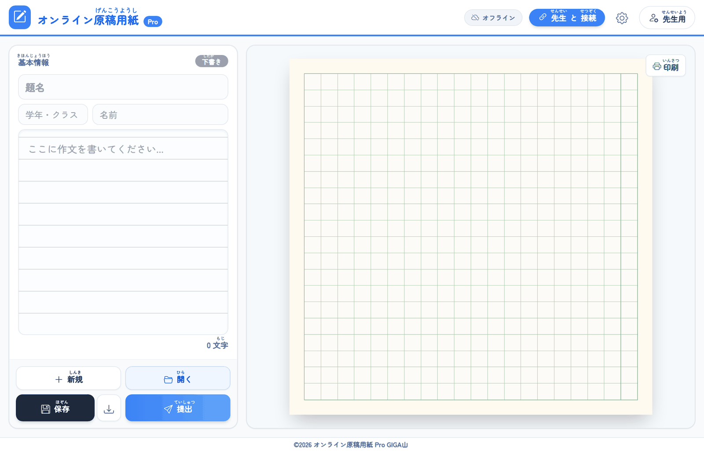

からの <ruby>原稿用紙<rt>げんこうようし</rt></ruby>が <ruby>出<rt>で</rt></ruby>ていれば OK です。

はじめて <ruby>使<rt>つか</rt></ruby>う <ruby>日<rt>ひ</rt></ruby>の <ruby>流<rt>なが</rt></ruby>れは、だいたい <ruby>次<rt>つぎ</rt></ruby>のように なります。

1. <ruby>先生<rt>せんせい</rt></ruby>が <ruby>先生用<rt>せんせいよう</rt></ruby>の <ruby>画面<rt>がめん</rt></ruby>で「<ruby>通信<rt>つうしん</rt></ruby>ルームを<ruby>開始<rt>かいし</rt></ruby>」を おし、あいことばを <ruby>黒板<rt>こくばん</rt></ruby>に <ruby>書<rt>か</rt></ruby>きます。
2. <ruby>児童<rt>じどう</rt></ruby>が アプリを <ruby>開<rt>ひら</rt></ruby>き、「<ruby>先生<rt>せんせい</rt></ruby>と<ruby>接続<rt>せつぞく</rt></ruby>」から あいことばを <ruby>入<rt>い</rt></ruby>れます。
3. <ruby>児童<rt>じどう</rt></ruby>が <ruby>題名<rt>だいめい</rt></ruby>・<ruby>名前<rt>なまえ</rt></ruby>・<ruby>本文<rt>ほんぶん</rt></ruby>を <ruby>入<rt>い</rt></ruby>れて、「<ruby>提出<rt>ていしゅつ</rt></ruby>」を おします。
4. <ruby>先生<rt>せんせい</rt></ruby>が <ruby>赤<rt>あか</rt></ruby>ペンを <ruby>入<rt>い</rt></ruby>れて「<ruby>再提出<rt>さいていしゅつ</rt></ruby>」で <ruby>返<rt>かえ</rt></ruby>します。
5. <ruby>児童<rt>じどう</rt></ruby>が <ruby>直<rt>なお</rt></ruby>して、もう <ruby>一度<rt>いちど</rt></ruby> <ruby>提出<rt>ていしゅつ</rt></ruby>します。<ruby>先生<rt>せんせい</rt></ruby>が よければ「<ruby>完了<rt>かんりょう</rt></ruby>」に します。

<ruby>接続<rt>せつぞく</rt></ruby>しなくても <ruby>作文<rt>さくぶん</rt></ruby>は <ruby>書<rt>か</rt></ruby>けます。<ruby>書<rt>か</rt></ruby>きはじめてから あとで つないでも かまいません。

【！】<ruby>覚<rt>おぼ</rt></ruby>えておくこと:

- <ruby>最初<rt>さいしょ</rt></ruby>の 1 <ruby>回<rt>かい</rt></ruby>だけは インターネットが <ruby>必要<rt>ひつよう</rt></ruby>です。<ruby>一度<rt>いちど</rt></ruby> <ruby>開<rt>ひら</rt></ruby>いた <ruby>端末<rt>たんまつ</rt></ruby>なら、つぎからは つながっていなくても <ruby>開<rt>ひら</rt></ruby>きます
- <ruby>先生<rt>せんせい</rt></ruby>と つないだり、AI に <ruby>手伝<rt>てつだ</rt></ruby>って もらったり する ときは、また インターネットが <ruby>必要<rt>ひつよう</rt></ruby>です
- <ruby>児童<rt>じどう</rt></ruby>の <ruby>端末<rt>たんまつ</rt></ruby>に <ruby>配<rt>くば</rt></ruby>る <ruby>前<rt>まえ</rt></ruby>に、<ruby>先生<rt>せんせい</rt></ruby>は <ruby>先生用<rt>せんせいよう</rt></ruby><ruby>設定<rt>せってい</rt></ruby>で パスワードを <ruby>決<rt>き</rt></ruby>めて ください

## <ruby>画面<rt>がめん</rt></ruby>の <ruby>見<rt>み</rt></ruby>かた ― どこに <ruby>何<rt>なに</rt></ruby>が あるか

この <ruby>章<rt>しょう</rt></ruby>では、<ruby>画面<rt>がめん</rt></ruby>の どこに <ruby>何<rt>なに</rt></ruby>が あるかを <ruby>見<rt>み</rt></ruby>ておきます。あとの <ruby>章<rt>しょう</rt></ruby>は、ここに <ruby>出<rt>で</rt></ruby>てくる <ruby>名前<rt>なまえ</rt></ruby>で ボタンを さします。

### <ruby>画面<rt>がめん</rt></ruby>の いちばん <ruby>上<rt>うえ</rt></ruby>に ならんでいる ボタン

<ruby>画面<rt>がめん</rt></ruby>の いちばん <ruby>上<rt>うえ</rt></ruby>には、<ruby>左<rt>ひだり</rt></ruby>から アプリの <ruby>名前<rt>なまえ</rt></ruby>、<ruby>右<rt>みぎ</rt></ruby>がわに いまの <ruby>様子<rt>ようす</rt></ruby>を しめす しるしと、いくつかの ボタンが ならびます。

- アプリの <ruby>名前<rt>なまえ</rt></ruby>（<ruby>左<rt>ひだり</rt></ruby>はし）… ここを おすと、いつでも <ruby>自分<rt>じぶん</rt></ruby>の <ruby>画面<rt>がめん</rt></ruby>に もどります
- まるい しるし … いま <ruby>保存<rt>ほぞん</rt></ruby>できているか、先生と つながっているかを しめします
- 「<ruby>追加<rt>ついか</rt></ruby>」… この アプリを ホーム<ruby>画面<rt>がめん</rt></ruby>に <ruby>入<rt>い</rt></ruby>れる ボタンです。いつも <ruby>出<rt>で</rt></ruby>ているとは かぎりません
- 「<ruby>先生<rt>せんせい</rt></ruby>と<ruby>接続<rt>せつぞく</rt></ruby>」… あいことばを <ruby>入<rt>い</rt></ruby>れて 先生と つなぐ ボタンです。つながると <ruby>消<rt>き</rt></ruby>えます
- <ruby>歯車<rt>はぐるま</rt></ruby>の しるし … <ruby>用紙<rt>ようし</rt></ruby>の マスの <ruby>数<rt>かず</rt></ruby>などを かえる「<ruby>設定<rt>せってい</rt></ruby>」を <ruby>開<rt>ひら</rt></ruby>きます
- 「<ruby>先生用<rt>せんせいよう</rt></ruby>」… 先生だけが つかう <ruby>画面<rt>がめん</rt></ruby>に かわります

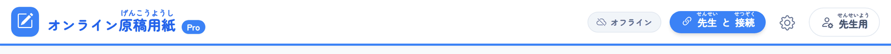

「<ruby>先生用<rt>せんせいよう</rt></ruby>」の <ruby>左<rt>ひだり</rt></ruby>どなりが <ruby>歯車<rt>はぐるま</rt></ruby>です。

### <ruby>入力<rt>にゅうりょく</rt></ruby>らんの <ruby>下<rt>した</rt></ruby>に ある 4 つの ボタン

<ruby>左<rt>ひだり</rt></ruby>がわの いちばん <ruby>下<rt>した</rt></ruby>には、よく つかう 4 つの ボタンが あります。まん<ruby>中<rt>なか</rt></ruby>の <ruby>小<rt>ちい</rt></ruby>さい ボタンは、<ruby>作文<rt>さくぶん</rt></ruby>を ファイルに して <ruby>取<rt>と</rt></ruby>り<ruby>出<rt>だ</rt></ruby>す ときに つかいます。

- 「<ruby>新規<rt>しんき</rt></ruby>」… <ruby>新<rt>あたら</rt></ruby>しい <ruby>作文<rt>さくぶん</rt></ruby>を <ruby>書<rt>か</rt></ruby>きはじめます
- 「<ruby>開<rt>ひら</rt></ruby>く」… <ruby>前<rt>まえ</rt></ruby>に <ruby>書<rt>か</rt></ruby>いた <ruby>作文<rt>さくぶん</rt></ruby>の <ruby>一覧<rt>いちらん</rt></ruby>を <ruby>出<rt>だ</rt></ruby>します
- 「<ruby>保存<rt>ほぞん</rt></ruby>」… いま <ruby>書<rt>か</rt></ruby>いている ものを <ruby>端末<rt>たんまつ</rt></ruby>に <ruby>保存<rt>ほぞん</rt></ruby>します
- 「<ruby>提出<rt>ていしゅつ</rt></ruby>」… 先生に <ruby>送<rt>おく</rt></ruby>ります

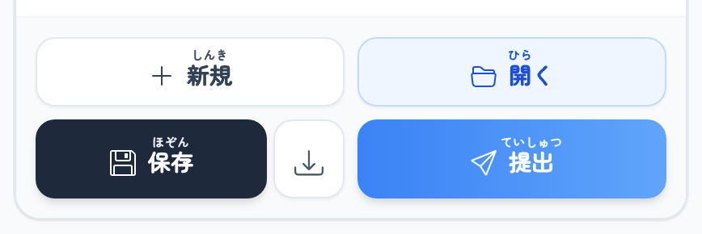

まん<ruby>中<rt>なか</rt></ruby>の <ruby>下<rt>した</rt></ruby>むきの <ruby>矢印<rt>やじるし</rt></ruby>が ファイルに <ruby>出<rt>だ</rt></ruby>す ボタンです。

### <ruby>画面<rt>がめん</rt></ruby>の せまい <ruby>端末<rt>たんまつ</rt></ruby>で つかうとき

タブレットを たてに して <ruby>使<rt>つか</rt></ruby>ったり、スマートフォンで <ruby>開<rt>ひら</rt></ruby>いたり すると、<ruby>左右<rt>さゆう</rt></ruby>に ならんでいた ものが <ruby>上下<rt>じょうげ</rt></ruby>に かわります。<ruby>上<rt>うえ</rt></ruby>が <ruby>入力<rt>にゅうりょく</rt></ruby>らん、<ruby>下<rt>した</rt></ruby>が <ruby>原稿用紙<rt>げんこうようし</rt></ruby>で、ボタンは いちばん <ruby>下<rt>した</rt></ruby>に <ruby>来<rt>き</rt></ruby>ます。できることは <ruby>何<rt>なに</rt></ruby>も かわりません。

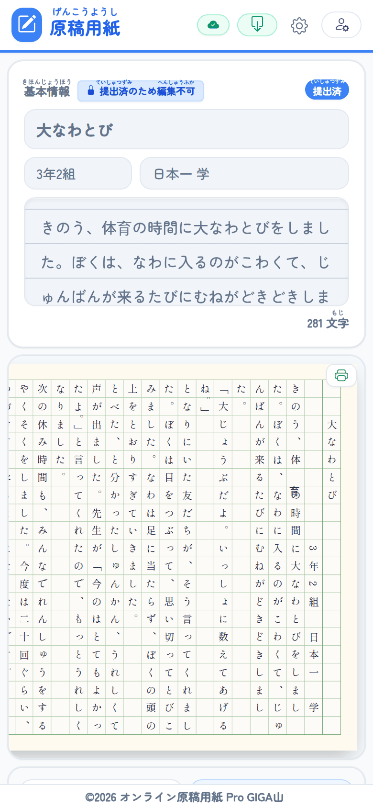

ボタンは <ruby>画面<rt>がめん</rt></ruby>の いちばん <ruby>下<rt>した</rt></ruby>に あります。

## <ruby>作文<rt>さくぶん</rt></ruby>を <ruby>書<rt>か</rt></ruby>く ― <ruby>題名<rt>だいめい</rt></ruby>・<ruby>名前<rt>なまえ</rt></ruby>・<ruby>本文<rt>ほんぶん</rt></ruby>を <ruby>入<rt>い</rt></ruby>れる

ここからが、じっさいに <ruby>書<rt>か</rt></ruby>く ところです。<ruby>入<rt>い</rt></ruby>れる <ruby>順番<rt>じゅんばん</rt></ruby>は <ruby>上<rt>うえ</rt></ruby>から <ruby>下<rt>した</rt></ruby>へで、とちゅうで <ruby>保存<rt>ほぞん</rt></ruby>ボタンを おす <ruby>必要<rt>ひつよう</rt></ruby>は ありません。

### <ruby>題名<rt>だいめい</rt></ruby>と <ruby>学年<rt>がくねん</rt></ruby>・クラス、<ruby>名前<rt>なまえ</rt></ruby>を <ruby>入<rt>い</rt></ruby>れる

<ruby>入力<rt>にゅうりょく</rt></ruby>らんの いちばん <ruby>上<rt>うえ</rt></ruby>が <ruby>題名<rt>だいめい</rt></ruby>、そのつぎが <ruby>学年<rt>がくねん</rt></ruby>・クラスと <ruby>名前<rt>なまえ</rt></ruby>です。

<ruby>入<rt>い</rt></ruby>れる <ruby>順番<rt>じゅんばん</rt></ruby>:

1. いちばん <ruby>上<rt>うえ</rt></ruby>の らんに <ruby>題名<rt>だいめい</rt></ruby>を <ruby>入<rt>い</rt></ruby>れてください。<ruby>原稿用紙<rt>げんこうようし</rt></ruby>の 1 <ruby>行目<rt>ぎょうめ</rt></ruby>、<ruby>上<rt>うえ</rt></ruby>から 3 マス<ruby>目<rt>め</rt></ruby>から <ruby>入<rt>はい</rt></ruby>ります。
2. <ruby>左<rt>ひだり</rt></ruby>の <ruby>小<rt>ちい</rt></ruby>さい らんに <ruby>学年<rt>がくねん</rt></ruby>・クラスを <ruby>入<rt>い</rt></ruby>れてください（<ruby>例<rt>れい</rt></ruby>: 3<ruby>年<rt>ねん</rt></ruby>2<ruby>組<rt>くみ</rt></ruby>）。
3. <ruby>右<rt>みぎ</rt></ruby>の らんに <ruby>名前<rt>なまえ</rt></ruby>を <ruby>入<rt>い</rt></ruby>れてください（<ruby>例<rt>れい</rt></ruby>: <ruby>日本一<rt>にっぽんいち</rt></ruby> <ruby>学<rt>まなぶ</rt></ruby>）。この 2 つは <ruby>題名<rt>だいめい</rt></ruby>の つぎの <ruby>行<rt>ぎょう</rt></ruby>に、<ruby>行<rt>ぎょう</rt></ruby>の おわりから 1 マス あけて ならびます。

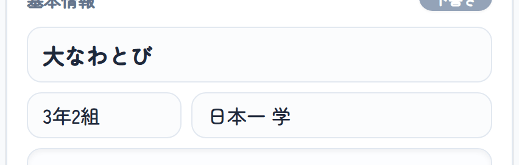

<ruby>上<rt>うえ</rt></ruby>が <ruby>題名<rt>だいめい</rt></ruby>、<ruby>下<rt>した</rt></ruby>の <ruby>左<rt>ひだり</rt></ruby>が <ruby>学年<rt>がくねん</rt></ruby>・クラスです。

【！】<ruby>覚<rt>おぼ</rt></ruby>えておくこと:

- <ruby>名前<rt>なまえ</rt></ruby>が からのままだと <ruby>提出<rt>ていしゅつ</rt></ruby>できません。<ruby>提出<rt>ていしゅつ</rt></ruby>する <ruby>前<rt>まえ</rt></ruby>に かならず <ruby>入<rt>い</rt></ruby>れてください
- 「<ruby>新規<rt>しんき</rt></ruby>」で <ruby>次<rt>つぎ</rt></ruby>の <ruby>作文<rt>さくぶん</rt></ruby>に <ruby>移<rt>うつ</rt></ruby>っても、<ruby>学年<rt>がくねん</rt></ruby>・クラスと <ruby>名前<rt>なまえ</rt></ruby>は そのまま のこります

### <ruby>本文<rt>ほんぶん</rt></ruby>を <ruby>打<rt>う</rt></ruby>つと、となりの <ruby>原稿用紙<rt>げんこうようし</rt></ruby>が <ruby>組<rt>く</rt></ruby>み<ruby>上<rt>あ</rt></ruby>がる

<ruby>名前<rt>なまえ</rt></ruby>の <ruby>下<rt>した</rt></ruby>の <ruby>広<rt>ひろ</rt></ruby>い らんが <ruby>本文<rt>ほんぶん</rt></ruby>です。よこ<ruby>書<rt>が</rt></ruby>きで <ruby>打<rt>う</rt></ruby>つと、<ruby>右<rt>みぎ</rt></ruby>の <ruby>原稿用紙<rt>げんこうようし</rt></ruby>が すぐに かわります。ここで <ruby>改行<rt>かいぎょう</rt></ruby>すると、<ruby>原稿用紙<rt>げんこうようし</rt></ruby>でも おなじ ところで <ruby>行<rt>ぎょう</rt></ruby>が かわります。<ruby>空<rt>あ</rt></ruby>けた <ruby>行<rt>ぎょう</rt></ruby>は、そのまま 1 <ruby>行分<rt>ぎょうぶん</rt></ruby>の <ruby>空<rt>あ</rt></ruby>きに なります。

らんの <ruby>右下<rt>みぎした</rt></ruby>には、いま <ruby>何<rt>なん</rt></ruby><ruby>文字<rt>もじ</rt></ruby> <ruby>書<rt>か</rt></ruby>いたかが <ruby>出<rt>で</rt></ruby>ます。<ruby>改行<rt>かいぎょう</rt></ruby>は <ruby>数<rt>かぞ</rt></ruby>えません。<ruby>入力<rt>にゅうりょく</rt></ruby>らんを <ruby>下<rt>した</rt></ruby>へ おくると、<ruby>原稿用紙<rt>げんこうようし</rt></ruby>も いっしょに <ruby>動<rt>うご</rt></ruby>きます。

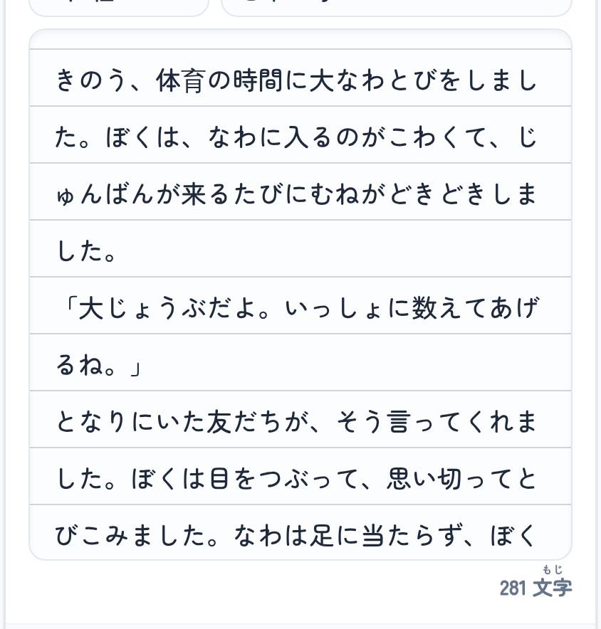

<ruby>右下<rt>みぎした</rt></ruby>の「281 <ruby>文字<rt>もじ</rt></ruby>」が いまの <ruby>字数<rt>じすう</rt></ruby>です。

<ruby>原稿用紙<rt>げんこうようし</rt></ruby>の きまりごとは、<ruby>打<rt>う</rt></ruby>つ <ruby>人<rt>ひと</rt></ruby>が <ruby>気<rt>き</rt></ruby>にしなくても そろいます。

- <ruby>行<rt>ぎょう</rt></ruby>の <ruby>先頭<rt>せんとう</rt></ruby>に 「、」「。」「」」「）」「ー」「っ」「ゃ」などが <ruby>来<rt>こ</rt></ruby>ないように <ruby>送<rt>おく</rt></ruby>ります
- <ruby>行<rt>ぎょう</rt></ruby>の おわりに 「「」「『」「（」などが <ruby>来<rt>こ</rt></ruby>ないように、<ruby>次<rt>つぎ</rt></ruby>の <ruby>行<rt>ぎょう</rt></ruby>へ <ruby>送<rt>おく</rt></ruby>ります
- 「。」」「、）」のように、<ruby>点<rt>てん</rt></ruby>と とじかっこが つづく ときは、2 <ruby>文字<rt>もじ</rt></ruby>を 1 マスに <ruby>入<rt>い</rt></ruby>れます
- 20<ruby>文字<rt>もじ</rt></ruby>の <ruby>設定<rt>せってい</rt></ruby>なら 20 <ruby>行<rt>ぎょう</rt></ruby>、15<ruby>文字<rt>もじ</rt></ruby>の <ruby>設定<rt>せってい</rt></ruby>なら 16 <ruby>行<rt>ぎょう</rt></ruby>で 1 ページです

<ruby>横<rt>よこ</rt></ruby>に ながい ときは、<ruby>原稿用紙<rt>げんこうようし</rt></ruby>を <ruby>横<rt>よこ</rt></ruby>へ おくると <ruby>次<rt>つぎ</rt></ruby>の ページが <ruby>見<rt>み</rt></ruby>られます。マウスの ホイールを <ruby>上下<rt>じょうげ</rt></ruby>に <ruby>回<rt>まわ</rt></ruby>しても <ruby>横<rt>よこ</rt></ruby>に <ruby>動<rt>うご</rt></ruby>きます。

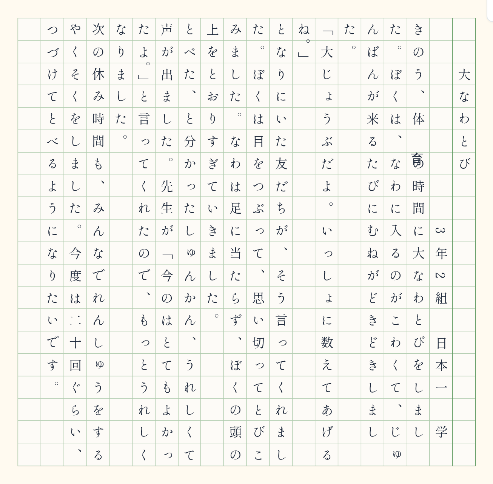

<ruby>右<rt>みぎ</rt></ruby>の <ruby>行<rt>ぎょう</rt></ruby>から <ruby>左<rt>ひだり</rt></ruby>へ すすみます。

## <ruby>保存<rt>ほぞん</rt></ruby>する・<ruby>開<rt>ひら</rt></ruby>く・<ruby>新<rt>あたら</rt></ruby>しく <ruby>書<rt>か</rt></ruby>きはじめる

<ruby>書<rt>か</rt></ruby>いた ものを <ruby>残<rt>のこ</rt></ruby>したり、また <ruby>開<rt>ひら</rt></ruby>いたり する ときの <ruby>話<rt>はなし</rt></ruby>です。すべて <ruby>左<rt>ひだり</rt></ruby>がわの <ruby>下<rt>した</rt></ruby>に ある ボタンで やります。

### <ruby>手<rt>て</rt></ruby>が <ruby>止<rt>と</rt></ruby>まると、<ruby>自動<rt>じどう</rt></ruby>で <ruby>保存<rt>ほぞん</rt></ruby>される

<ruby>打<rt>う</rt></ruby>つ <ruby>手<rt>て</rt></ruby>が しばらく <ruby>止<rt>と</rt></ruby>まると、アプリが <ruby>自分<rt>じぶん</rt></ruby>で <ruby>端末<rt>たんまつ</rt></ruby>に <ruby>保存<rt>ほぞん</rt></ruby>します。だから「<ruby>保存<rt>ほぞん</rt></ruby>」を おしわすれても <ruby>消<rt>き</rt></ruby>えません。<ruby>自分<rt>じぶん</rt></ruby>の <ruby>好<rt>す</rt></ruby>きな ところで <ruby>残<rt>のこ</rt></ruby>したい ときだけ、「<ruby>保存<rt>ほぞん</rt></ruby>」を おしてください。おすと、<ruby>画面<rt>がめん</rt></ruby>の <ruby>下<rt>した</rt></ruby>に <ruby>黒<rt>くろ</rt></ruby>い しらせが <ruby>出<rt>で</rt></ruby>ます。

先生と つながって いる ときは、<ruby>保存<rt>ほぞん</rt></ruby>と <ruby>同時<rt>どうじ</rt></ruby>に 先生の <ruby>端末<rt>たんまつ</rt></ruby>にも <ruby>送<rt>おく</rt></ruby>られます。そのときの しらせは「せんせいと どうきし、たんまつにも ほぞん しました」に かわります。

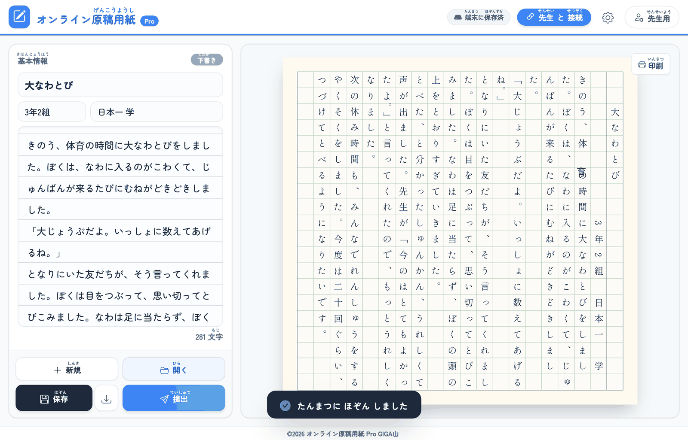

<ruby>画面<rt>がめん</rt></ruby>の <ruby>下<rt>した</rt></ruby>に <ruby>数秒<rt>すうびょう</rt></ruby>だけ <ruby>出<rt>で</rt></ruby>ます。

### <ruby>新<rt>あたら</rt></ruby>しく <ruby>書<rt>か</rt></ruby>きはじめる・<ruby>前<rt>まえ</rt></ruby>に <ruby>書<rt>か</rt></ruby>いた <ruby>作文<rt>さくぶん</rt></ruby>を <ruby>開<rt>ひら</rt></ruby>く

「<ruby>新規<rt>しんき</rt></ruby>」を おすと、<ruby>入力<rt>にゅうりょく</rt></ruby>らんが からに なって、<ruby>次<rt>つぎ</rt></ruby>の <ruby>作文<rt>さくぶん</rt></ruby>を <ruby>書<rt>か</rt></ruby>きはじめられます。<ruby>書<rt>か</rt></ruby>きかけの ものが あるときは、<ruby>下<rt>した</rt></ruby>の たしかめる <ruby>画面<rt>がめん</rt></ruby>が <ruby>出<rt>で</rt></ruby>ます。「<ruby>新<rt>あたら</rt></ruby>しく<ruby>書<rt>か</rt></ruby>く」を おすと すすみ、「キャンセル」で もどります。

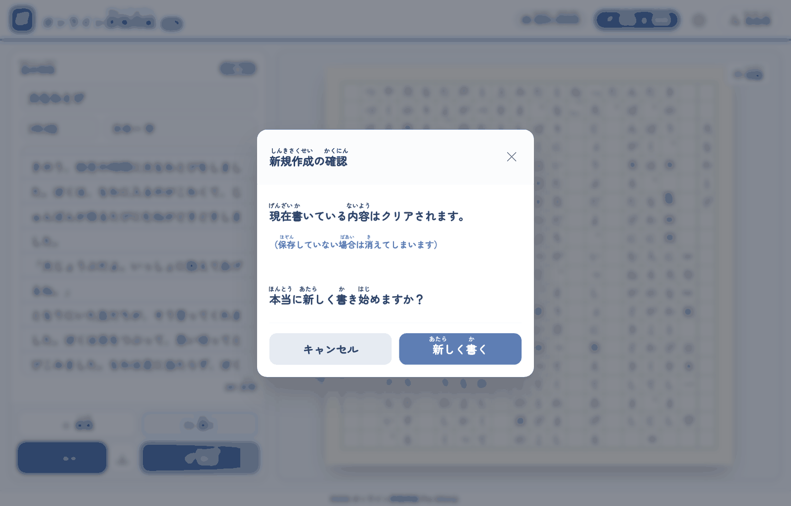

<ruby>学年<rt>がくねん</rt></ruby>・クラスと <ruby>名前<rt>なまえ</rt></ruby>は <ruby>残<rt>のこ</rt></ruby>ります。

「<ruby>開<rt>ひら</rt></ruby>く」を おすと、この <ruby>端末<rt>たんまつ</rt></ruby>に <ruby>保存<rt>ほぞん</rt></ruby>した <ruby>作文<rt>さくぶん</rt></ruby>が ならびます。いちばん <ruby>上<rt>うえ</rt></ruby>の らんに <ruby>言葉<rt>ことば</rt></ruby>を <ruby>入<rt>い</rt></ruby>れると、<ruby>題名<rt>だいめい</rt></ruby>・<ruby>名前<rt>なまえ</rt></ruby>・<ruby>本文<rt>ほんぶん</rt></ruby>から さがせます。<ruby>開<rt>ひら</rt></ruby>きたい ものを おせば、そのまま つづきが <ruby>書<rt>か</rt></ruby>けます。

いちばん <ruby>下<rt>した</rt></ruby>の「ファイルから<ruby>読<rt>よ</rt></ruby>み<ruby>込<rt>こ</rt></ruby>む」は、<ruby>別<rt>べつ</rt></ruby>の <ruby>端末<rt>たんまつ</rt></ruby>や 先生から もらった ファイルを <ruby>開<rt>ひら</rt></ruby>く ときに つかいます。

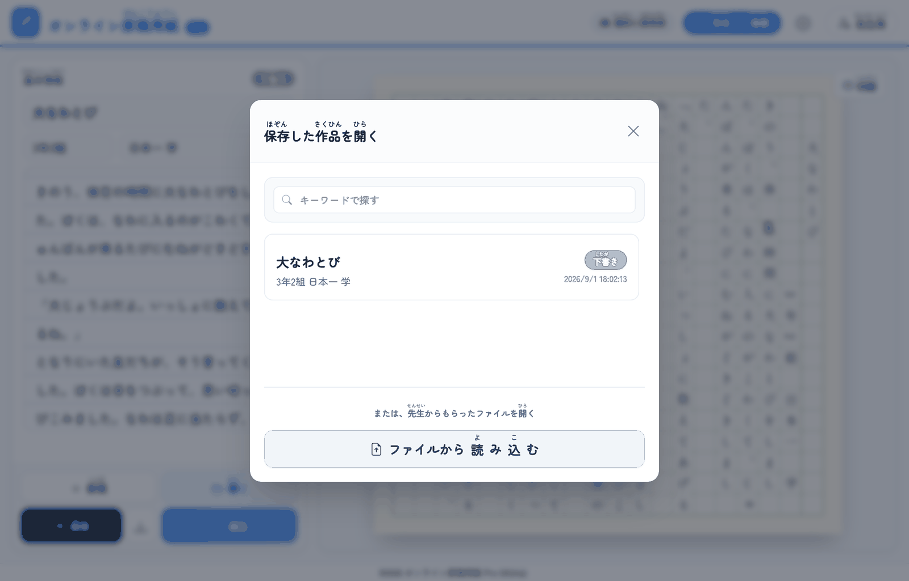

<ruby>右<rt>みぎ</rt></ruby>はしの <ruby>色<rt>いろ</rt></ruby>つきの しるしが いまの <ruby>様子<rt>ようす</rt></ruby>です。

## <ruby>先生<rt>せんせい</rt></ruby>と つないで、<ruby>作文<rt>さくぶん</rt></ruby>を <ruby>提出<rt>ていしゅつ</rt></ruby>する

<ruby>作文<rt>さくぶん</rt></ruby>を 先生に <ruby>出<rt>だ</rt></ruby>すには、さきに 先生と つなぎます。<ruby>先<rt>さき</rt></ruby>に <ruby>書<rt>か</rt></ruby>きはじめてから つないでも かまいません。

<ruby>大<rt>おお</rt></ruby>きな <ruby>流<rt>なが</rt></ruby>れ:

1. 「<ruby>先生<rt>せんせい</rt></ruby>と<ruby>接続<rt>せつぞく</rt></ruby>」を おして、あいことばを <ruby>入<rt>い</rt></ruby>れる。
2. <ruby>画面<rt>がめん</rt></ruby>の <ruby>上<rt>うえ</rt></ruby>の しるしが「<ruby>先生<rt>せんせい</rt></ruby>と<ruby>同期済<rt>どうきずみ</rt></ruby>」に かわったのを たしかめる。
3. 「<ruby>提出<rt>ていしゅつ</rt></ruby>」を おして、たしかめの <ruby>画面<rt>がめん</rt></ruby>で「はい、ていしゅつします」を おす。

### あいことばを <ruby>入<rt>い</rt></ruby>れて <ruby>先生<rt>せんせい</rt></ruby>と つなぐ

<ruby>画面<rt>がめん</rt></ruby>の <ruby>上<rt>うえ</rt></ruby>に ある「<ruby>先生<rt>せんせい</rt></ruby>と<ruby>接続<rt>せつぞく</rt></ruby>」（くさりの しるし）を おします。<ruby>入力<rt>にゅうりょく</rt></ruby>らんが <ruby>出<rt>で</rt></ruby>るので、先生の <ruby>画面<rt>がめん</rt></ruby>に <ruby>出<rt>で</rt></ruby>ている 10<ruby>文字<rt>もじ</rt></ruby>の あいことばを <ruby>打<rt>う</rt></ruby>って、「<ruby>接続<rt>せつぞく</rt></ruby>する」を おしてください。

<ruby>小<rt>ちい</rt></ruby>さい <ruby>文字<rt>もじ</rt></ruby>で <ruby>打<rt>う</rt></ruby>っても とおります。まん<ruby>中<rt>なか</rt></ruby>の「-」は <ruby>入<rt>い</rt></ruby>れても <ruby>入<rt>い</rt></ruby>れなくても かまいません。<ruby>見<rt>み</rt></ruby>まちがえやすい 0 と O、1 と I と L は <ruby>使<rt>つか</rt></ruby>っていないので、<ruby>黒板<rt>こくばん</rt></ruby>の <ruby>写<rt>うつ</rt></ruby>しでも まよいません。

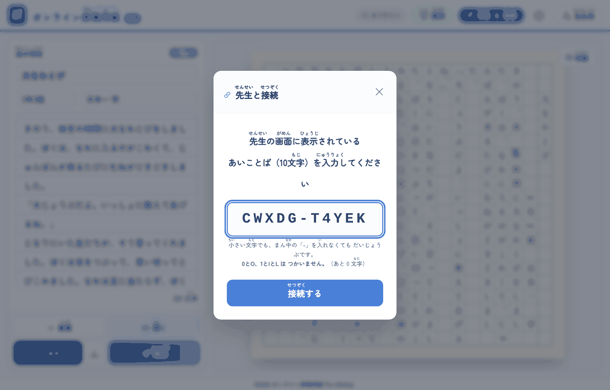

のこりの <ruby>字数<rt>じすう</rt></ruby>が <ruby>下<rt>した</rt></ruby>に <ruby>出<rt>で</rt></ruby>ます。

### つながったか どうかを <ruby>画面<rt>がめん</rt></ruby>の しるしで たしかめる

<ruby>画面<rt>がめん</rt></ruby>の <ruby>上<rt>うえ</rt></ruby>に ある まるい しるしが、いまの <ruby>様子<rt>ようす</rt></ruby>を しめします。

- オフライン … 先生と つながっていません
- <ruby>接続中<rt>せつぞくちゅう</rt></ruby>... … いま つなごうと しています
- <ruby>保存中<rt>ほぞんちゅう</rt></ruby>... … <ruby>端末<rt>たんまつ</rt></ruby>に <ruby>保存<rt>ほぞん</rt></ruby>して います
- <ruby>保存<rt>ほぞん</rt></ruby>・<ruby>同期中<rt>どうきちゅう</rt></ruby>... … <ruby>保存<rt>ほぞん</rt></ruby>して、先生にも <ruby>送<rt>おく</rt></ruby>って います
- <ruby>端末<rt>たんまつ</rt></ruby>に<ruby>保存済<rt>ほぞんずみ</rt></ruby> … <ruby>端末<rt>たんまつ</rt></ruby>には <ruby>入<rt>はい</rt></ruby>りました。まだ 先生とは つながっていません
- <ruby>先生<rt>せんせい</rt></ruby>と<ruby>同期済<rt>どうきずみ</rt></ruby>（<ruby>緑色<rt>みどりいろ</rt></ruby>） … 先生と つながって います

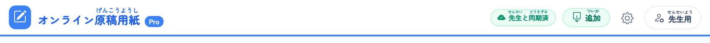

<ruby>緑色<rt>みどりいろ</rt></ruby>に なれば つながって います。

【！】<ruby>覚<rt>おぼ</rt></ruby>えておくこと:

- つながると「<ruby>先生<rt>せんせい</rt></ruby>と<ruby>接続<rt>せつぞく</rt></ruby>」の ボタンは <ruby>消<rt>き</rt></ruby>えます。それが つながった しるしです
- つないだ とたんに、<ruby>前<rt>まえ</rt></ruby>に <ruby>提出<rt>ていしゅつ</rt></ruby>した ものの <ruby>新<rt>あたら</rt></ruby>しい <ruby>添削<rt>てんさく</rt></ruby>が あれば、<ruby>自動<rt>じどう</rt></ruby>で <ruby>返<rt>かえ</rt></ruby>ってきます
- <ruby>先週<rt>せんしゅう</rt></ruby>の つづきでも、つなぐだけで いちばん <ruby>新<rt>あたら</rt></ruby>しい <ruby>赤<rt>あか</rt></ruby>ペンが とどきます

### <ruby>作文<rt>さくぶん</rt></ruby>を <ruby>提出<rt>ていしゅつ</rt></ruby>して、<ruby>状態<rt>じょうたい</rt></ruby>の しるしを たしかめる

<ruby>青<rt>あお</rt></ruby>い「<ruby>提出<rt>ていしゅつ</rt></ruby>」の ボタンを おします。たしかめの <ruby>画面<rt>がめん</rt></ruby>が <ruby>出<rt>で</rt></ruby>るので、よければ「はい、ていしゅつします」を おしてください。やめる ときは「キャンセル」です。

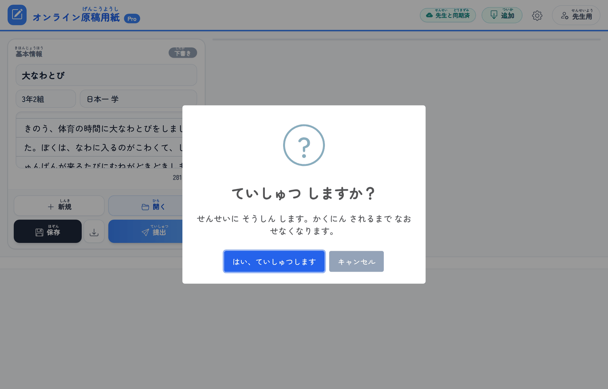

<ruby>出<rt>だ</rt></ruby>すと <ruby>直<rt>なお</rt></ruby>せなくなる、と <ruby>書<rt>か</rt></ruby>いてあります。

【！】<ruby>覚<rt>おぼ</rt></ruby>えておくこと:

- <ruby>名前<rt>なまえ</rt></ruby>が からのときは「なまえを かいてから ていしゅつ してください」と <ruby>出<rt>で</rt></ruby>て、<ruby>出<rt>だ</rt></ruby>せません
- 先生と つながっていない ときも <ruby>出<rt>だ</rt></ruby>せません。とどいていないのに <ruby>出<rt>だ</rt></ruby>した ことに なるのを ふせぐ ためです
- <ruby>提出<rt>ていしゅつ</rt></ruby>は <ruby>何度<rt>なんど</rt></ruby>でも できます。<ruby>直<rt>なお</rt></ruby>して また <ruby>出<rt>だ</rt></ruby>すのが ふつうの つかいかたです

<ruby>出<rt>だ</rt></ruby>したあとは、<ruby>入力<rt>にゅうりょく</rt></ruby>らんが はい<ruby>色<rt>いろ</rt></ruby>に なって「<ruby>提出済<rt>ていしゅつずみ</rt></ruby>のため<ruby>編集不可<rt>へんしゅうふか</rt></ruby>」と <ruby>出<rt>で</rt></ruby>ます。先生が <ruby>見<rt>み</rt></ruby>ている <ruby>間<rt>あいだ</rt></ruby>に <ruby>文<rt>ぶん</rt></ruby>が かわらない ようにする ためです。

<ruby>右上<rt>みぎうえ</rt></ruby>の しるしは、いまの <ruby>作文<rt>さくぶん</rt></ruby>が どの <ruby>状態<rt>じょうたい</rt></ruby>かを しめします。

- <ruby>下書<rt>したが</rt></ruby>き（はい<ruby>色<rt>いろ</rt></ruby>）… まだ <ruby>出<rt>だ</rt></ruby>していません。<ruby>直<rt>なお</rt></ruby>せます
- <ruby>提出済<rt>ていしゅつずみ</rt></ruby>（<ruby>青<rt>あお</rt></ruby>）… <ruby>出<rt>だ</rt></ruby>しました。先生の <ruby>返事<rt>へんじ</rt></ruby>まちです。<ruby>直<rt>なお</rt></ruby>せません
- <ruby>再提出<rt>さいていしゅつ</rt></ruby>（オレンジ）… 先生が「<ruby>直<rt>なお</rt></ruby>してね」と <ruby>返<rt>かえ</rt></ruby>しました。<ruby>直<rt>なお</rt></ruby>せます
- <ruby>完了<rt>かんりょう</rt></ruby>（<ruby>緑<rt>みどり</rt></ruby>）… 先生が おわりに しました。<ruby>直<rt>なお</rt></ruby>せません

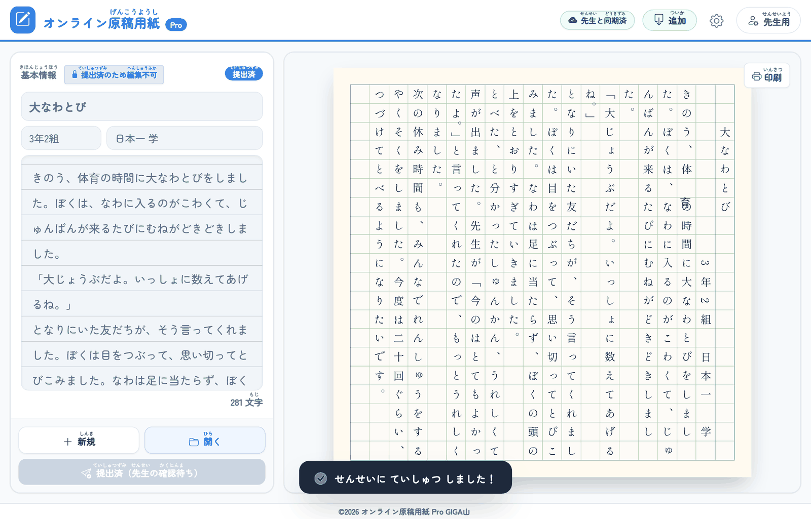

かぎの しるしが <ruby>直<rt>なお</rt></ruby>せない しるしです。

## <ruby>先生<rt>せんせい</rt></ruby>から <ruby>返<rt>かえ</rt></ruby>ってきた <ruby>赤<rt>あか</rt></ruby>ペンを <ruby>読<rt>よ</rt></ruby>んで <ruby>直<rt>なお</rt></ruby>す

先生が <ruby>赤<rt>あか</rt></ruby>ペンを <ruby>入<rt>い</rt></ruby>れて <ruby>返<rt>かえ</rt></ruby>すと、つながって いる <ruby>間<rt>あいだ</rt></ruby>は その <ruby>場<rt>ば</rt></ruby>で とどきます。つながって いない ときは、<ruby>次<rt>つぎ</rt></ruby>に つないだ ときに まとめて とどきます。

### ベルの しるしで <ruby>返<rt>かえ</rt></ruby>ってきた ことを <ruby>知<rt>し</rt></ruby>る

<ruby>返<rt>かえ</rt></ruby>ってきた <ruby>作文<rt>さくぶん</rt></ruby>が 1 つでも あると、<ruby>画面<rt>がめん</rt></ruby>の <ruby>上<rt>うえ</rt></ruby>に きいろい ベルの しるしが <ruby>出<rt>で</rt></ruby>ます。まだ <ruby>読<rt>よ</rt></ruby>んでいない ものが あると、<ruby>赤<rt>あか</rt></ruby>い まるに <ruby>数<rt>かず</rt></ruby>が つきます。<ruby>返<rt>かえ</rt></ruby>ってきた ものが 1 つも ないときは、ベルそのものが <ruby>出<rt>で</rt></ruby>ません。

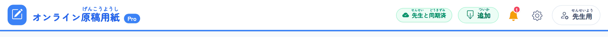

<ruby>赤<rt>あか</rt></ruby>い まるの <ruby>数字<rt>すうじ</rt></ruby>が <ruby>読<rt>よ</rt></ruby>んでいない <ruby>数<rt>かず</rt></ruby>です。

### <ruby>返<rt>かえ</rt></ruby>ってきた <ruby>作文<rt>さくぶん</rt></ruby>を <ruby>開<rt>ひら</rt></ruby>く

ベルを おすと「<ruby>先生<rt>せんせい</rt></ruby>からの<ruby>返却<rt>へんきゃく</rt></ruby>」の <ruby>一覧<rt>いちらん</rt></ruby>が <ruby>出<rt>で</rt></ruby>ます。まだ <ruby>読<rt>よ</rt></ruby>んでいない ものには「New」が つきます。「<ruby>確認<rt>かくにん</rt></ruby>する」を おすと、その <ruby>作文<rt>さくぶん</rt></ruby>が <ruby>開<rt>ひら</rt></ruby>いて、「New」は <ruby>消<rt>き</rt></ruby>えます。

<ruby>一覧<rt>いちらん</rt></ruby>の <ruby>左上<rt>ひだりうえ</rt></ruby>には、その <ruby>作文<rt>さくぶん</rt></ruby>が「<ruby>再提出<rt>さいていしゅつ</rt></ruby>」なのか「<ruby>完了<rt>かんりょう</rt></ruby>」なのかも <ruby>出<rt>で</rt></ruby>ます。「<ruby>再提出<rt>さいていしゅつ</rt></ruby>」なら、まだ <ruby>直<rt>なお</rt></ruby>して <ruby>出<rt>だ</rt></ruby>しなおす ばんです。

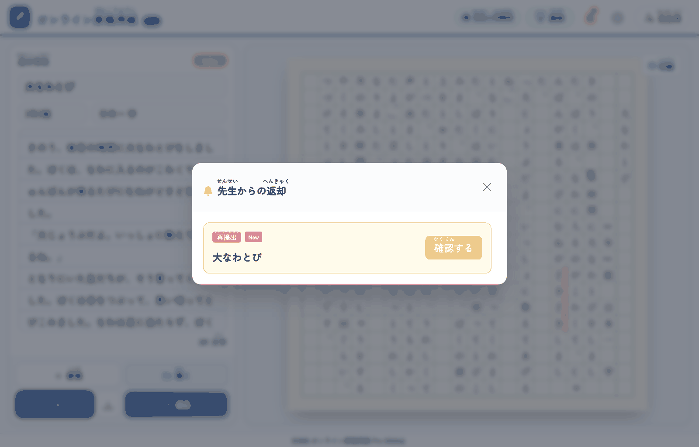

オレンジ<ruby>色<rt>いろ</rt></ruby>の ものが まだ <ruby>読<rt>よ</rt></ruby>んでいない ものです。

### <ruby>赤<rt>あか</rt></ruby>い マスを おして コメントを <ruby>読<rt>よ</rt></ruby>み、<ruby>直<rt>なお</rt></ruby>したら <ruby>消<rt>け</rt></ruby>す

<ruby>開<rt>ひら</rt></ruby>いた <ruby>作文<rt>さくぶん</rt></ruby>の <ruby>原稿用紙<rt>げんこうようし</rt></ruby>を <ruby>見<rt>み</rt></ruby>ると、<ruby>先生<rt>せんせい</rt></ruby>が なぞった ところが うすい <ruby>赤<rt>あか</rt></ruby>に なって、よこに <ruby>赤<rt>あか</rt></ruby>い <ruby>線<rt>せん</rt></ruby>が <ruby>入<rt>はい</rt></ruby>っています。そこが <ruby>直<rt>なお</rt></ruby>して ほしい ところです。

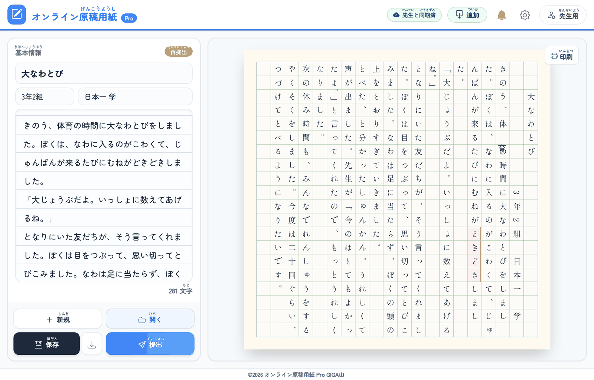

<ruby>赤<rt>あか</rt></ruby>い ところが <ruby>先生<rt>せんせい</rt></ruby>の <ruby>指摘<rt>してき</rt></ruby>です。

<ruby>赤<rt>あか</rt></ruby>い マスを おすと、<ruby>先生<rt>せんせい</rt></ruby>の コメントが <ruby>読<rt>よ</rt></ruby>めます。<ruby>読<rt>よ</rt></ruby>んだら、<ruby>右上<rt>みぎうえ</rt></ruby>の × か、<ruby>画面<rt>がめん</rt></ruby>の <ruby>外<rt>そと</rt></ruby>を おせば とじられます。

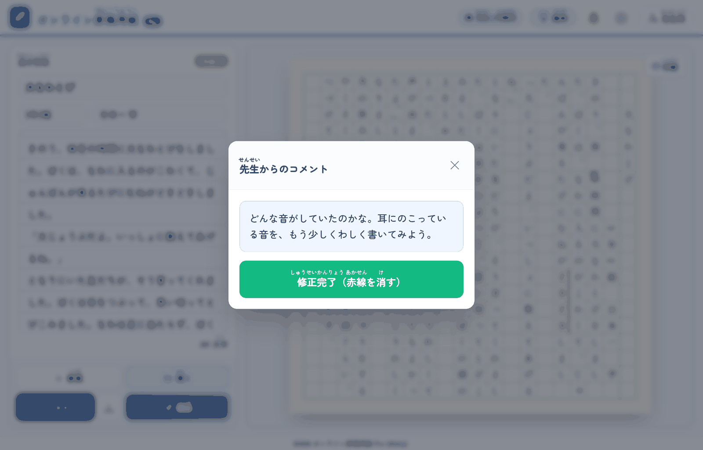

<ruby>下<rt>した</rt></ruby>の <ruby>緑<rt>みどり</rt></ruby>の ボタンで <ruby>赤<rt>あか</rt></ruby>い <ruby>線<rt>せん</rt></ruby>を <ruby>消<rt>け</rt></ruby>せます。

コメントの とおりに <ruby>本文<rt>ほんぶん</rt></ruby>を <ruby>直<rt>なお</rt></ruby>したら、もう <ruby>一度<rt>いちど</rt></ruby> その <ruby>赤<rt>あか</rt></ruby>い マスを おして、「<ruby>修正完了<rt>しゅうせいかんりょう</rt></ruby>（<ruby>赤線<rt>あかせん</rt></ruby>を<ruby>消<rt>け</rt></ruby>す）」を おしてください。<ruby>自分<rt>じぶん</rt></ruby>の <ruby>画面<rt>がめん</rt></ruby>から <ruby>赤<rt>あか</rt></ruby>い しるしが <ruby>消<rt>き</rt></ruby>え、どこが まだ <ruby>残<rt>のこ</rt></ruby>って いるかが はっきりします。

<ruby>全部<rt>ぜんぶ</rt></ruby> <ruby>直<rt>なお</rt></ruby>し おわったら、もう <ruby>一度<rt>いちど</rt></ruby>「<ruby>提出<rt>ていしゅつ</rt></ruby>」を おして <ruby>出<rt>だ</rt></ruby>しなおします。

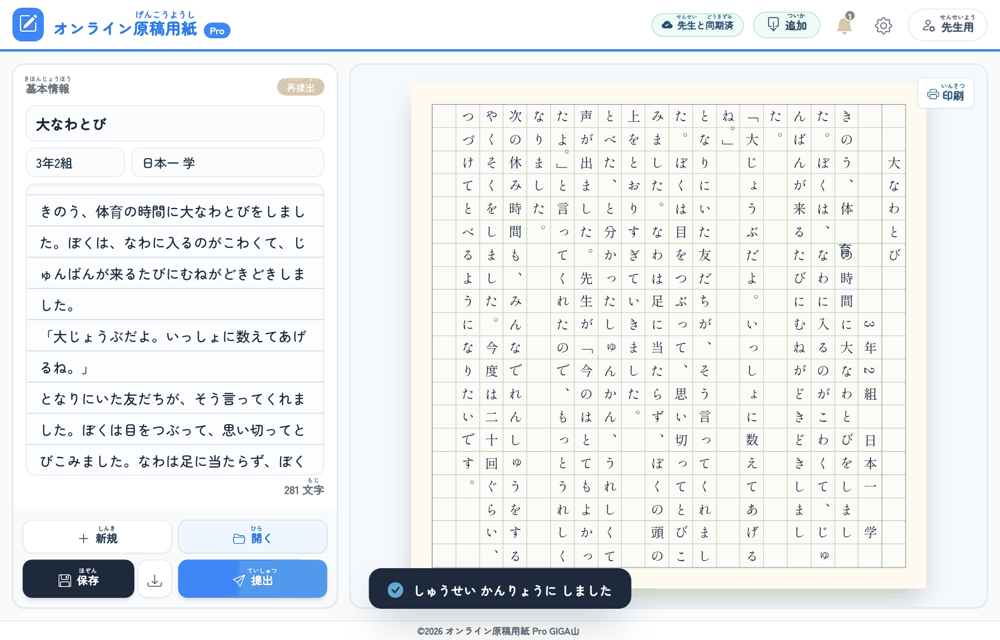

<ruby>消<rt>け</rt></ruby>した ことが <ruby>下<rt>した</rt></ruby>の しらせで わかります。

【！】<ruby>覚<rt>おぼ</rt></ruby>えておくこと:

- <ruby>提出済<rt>ていしゅつずみ</rt></ruby>や <ruby>完了<rt>かんりょう</rt></ruby>の <ruby>間<rt>あいだ</rt></ruby>は、この ボタンが「<ruby>提出中<rt>ていしゅつちゅう</rt></ruby>のため<ruby>変更不可<rt>へんこうふか</rt></ruby>」に かわって おせません
- <ruby>消<rt>け</rt></ruby>したのは <ruby>自分<rt>じぶん</rt></ruby>の <ruby>画面<rt>がめん</rt></ruby>の しるしだけです。<ruby>先生<rt>せんせい</rt></ruby>の <ruby>画面<rt>がめん</rt></ruby>では <ruby>緑色<rt>みどりいろ</rt></ruby>に かわって <ruby>残<rt>のこ</rt></ruby>ります

### 「<ruby>完了<rt>かんりょう</rt></ruby>」に なった <ruby>作文<rt>さくぶん</rt></ruby>を <ruby>書<rt>か</rt></ruby>き<ruby>直<rt>なお</rt></ruby>したい とき

「<ruby>完了<rt>かんりょう</rt></ruby>」に なった <ruby>作文<rt>さくぶん</rt></ruby>は <ruby>直<rt>なお</rt></ruby>せません。それでも つづきを <ruby>書<rt>か</rt></ruby>きたい ときは、<ruby>下<rt>した</rt></ruby>に <ruby>出<rt>で</rt></ruby>ている <ruby>緑<rt>みどり</rt></ruby>の「コピーして<ruby>新<rt>あたら</rt></ruby>しく<ruby>書<rt>か</rt></ruby>く」を おしてください。おなじ <ruby>中身<rt>なかみ</rt></ruby>の <ruby>新<rt>あたら</rt></ruby>しい <ruby>下書<rt>したが</rt></ruby>きが できて、そこから <ruby>直<rt>なお</rt></ruby>せます。

もとの「<ruby>完了<rt>かんりょう</rt></ruby>」の <ruby>作文<rt>さくぶん</rt></ruby>は そのまま <ruby>残<rt>のこ</rt></ruby>ります。「<ruby>開<rt>ひら</rt></ruby>く」の <ruby>一覧<rt>いちらん</rt></ruby>から いつでも <ruby>読<rt>よ</rt></ruby>み<ruby>返<rt>かえ</rt></ruby>せます。

## <ruby>原稿用紙<rt>げんこうようし</rt></ruby>の マスの <ruby>数<rt>かず</rt></ruby>と <ruby>禁則処理<rt>きんそくしょり</rt></ruby>を かえる（<ruby>設定<rt>せってい</rt></ruby>）

<ruby>用紙<rt>ようし</rt></ruby>の マスの <ruby>数<rt>かず</rt></ruby>は、<ruby>学年<rt>がくねん</rt></ruby>に あわせて かえられます。かえた <ruby>設定<rt>せってい</rt></ruby>は この <ruby>端末<rt>たんまつ</rt></ruby>に <ruby>残<rt>のこ</rt></ruby>り、<ruby>画面<rt>がめん</rt></ruby>にも <ruby>印刷<rt>いんさつ</rt></ruby>にも つかわれます。

### <ruby>設定<rt>せってい</rt></ruby>を <ruby>開<rt>ひら</rt></ruby>いて、<ruby>用紙<rt>ようし</rt></ruby>の マスの <ruby>数<rt>かず</rt></ruby>を えらぶ

<ruby>画面<rt>がめん</rt></ruby>の <ruby>上<rt>うえ</rt></ruby>に ある <ruby>歯車<rt>はぐるま</rt></ruby>の しるしを おすと「<ruby>設定<rt>せってい</rt></ruby>」が <ruby>開<rt>ひら</rt></ruby>きます。えらべるのは <ruby>次<rt>つぎ</rt></ruby>の 2 つです。

- 20<ruby>文字<rt>もじ</rt></ruby> × 20<ruby>行<rt>ぎょう</rt></ruby>（<ruby>高学年<rt>こうがくねん</rt></ruby>）… <ruby>最初<rt>さいしょ</rt></ruby>は こちらです
- 15<ruby>文字<rt>もじ</rt></ruby> × 16<ruby>行<rt>ぎょう</rt></ruby>（<ruby>低学年<rt>ていがくねん</rt></ruby>）… マスが <ruby>大<rt>おお</rt></ruby>きく なります

えらんだら、いちばん <ruby>下<rt>した</rt></ruby>の「<ruby>保存<rt>ほぞん</rt></ruby>して<ruby>閉<rt>と</rt></ruby>じる」を おしてください。

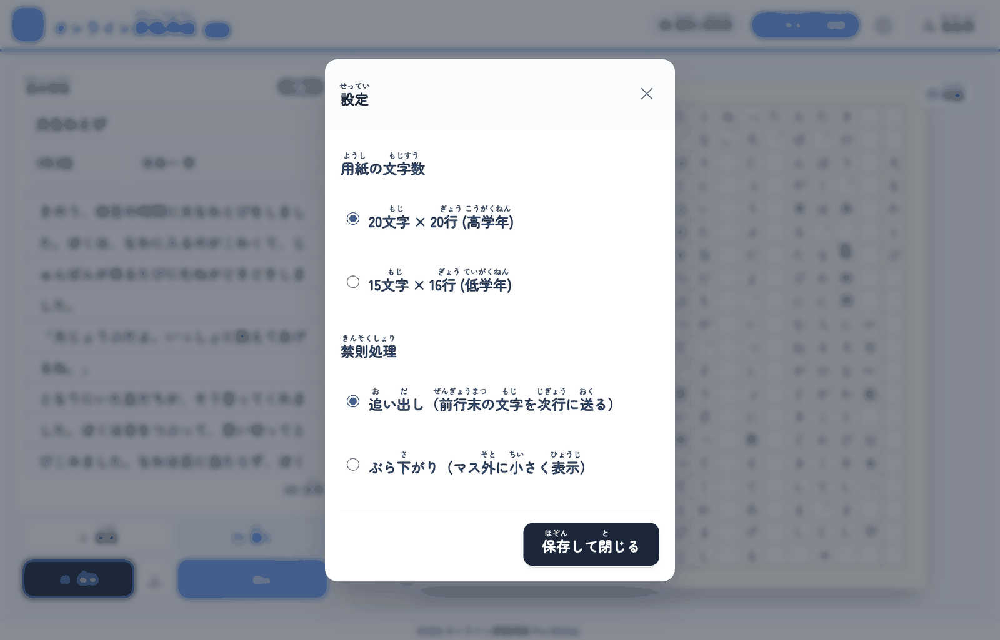

<ruby>上<rt>うえ</rt></ruby>が マスの <ruby>数<rt>かず</rt></ruby>、<ruby>下<rt>した</rt></ruby>が <ruby>禁則処理<rt>きんそくしょり</rt></ruby>です。

15<ruby>文字<rt>もじ</rt></ruby> × 16<ruby>行<rt>ぎょう</rt></ruby>を えらぶと、1 マスが <ruby>大<rt>おお</rt></ruby>きくなり、<ruby>字<rt>じ</rt></ruby>も <ruby>大<rt>おお</rt></ruby>きく なります。1 <ruby>年生<rt>ねんせい</rt></ruby>や 2 <ruby>年生<rt>ねんせい</rt></ruby>が <ruby>書<rt>か</rt></ruby>くときは こちらが <ruby>読<rt>よ</rt></ruby>みやすいです。1 ページは 16 <ruby>行<rt>ぎょう</rt></ruby>に かわります。

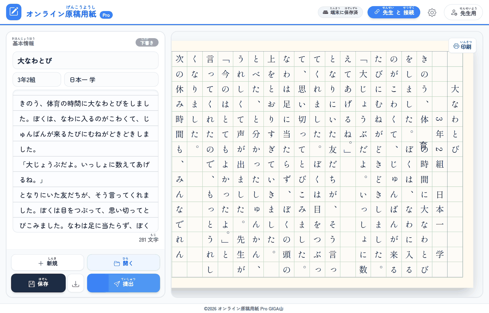

マスが <ruby>大<rt>おお</rt></ruby>きく なりました。

### <ruby>禁則処理<rt>きんそくしょり</rt></ruby>の「<ruby>追<rt>お</rt></ruby>い<ruby>出<rt>だ</rt></ruby>し」と「ぶら<ruby>下<rt>さ</rt></ruby>がり」の ちがい

<ruby>行<rt>ぎょう</rt></ruby>の <ruby>先頭<rt>せんとう</rt></ruby>に「、」や「。」が <ruby>来<rt>き</rt></ruby>そうな ときの やり<ruby>方<rt>かた</rt></ruby>を、2 つから えらべます。

- <ruby>追<rt>お</rt></ruby>い<ruby>出<rt>だ</rt></ruby>し（<ruby>最初<rt>さいしょ</rt></ruby>は こちら）… <ruby>前<rt>まえ</rt></ruby>の <ruby>行<rt>ぎょう</rt></ruby>の いちばん <ruby>下<rt>した</rt></ruby>の <ruby>文字<rt>もじ</rt></ruby>を <ruby>次<rt>つぎ</rt></ruby>の <ruby>行<rt>ぎょう</rt></ruby>へ <ruby>送<rt>おく</rt></ruby>って そろえます。マス<ruby>目<rt>め</rt></ruby>が きれいに ならびます
- ぶら<ruby>下<rt>さ</rt></ruby>がり … その <ruby>文字<rt>もじ</rt></ruby>を <ruby>行<rt>ぎょう</rt></ruby>の おわりの マスの <ruby>外<rt>そと</rt></ruby>に <ruby>小<rt>ちい</rt></ruby>さく <ruby>出<rt>だ</rt></ruby>します。<ruby>文<rt>ぶん</rt></ruby>の <ruby>切<rt>き</rt></ruby>れ<ruby>目<rt>め</rt></ruby>が <ruby>動<rt>うご</rt></ruby>かないので、<ruby>原稿用紙<rt>げんこうようし</rt></ruby>の <ruby>書<rt>か</rt></ruby>き<ruby>方<rt>かた</rt></ruby>を <ruby>習<rt>なら</rt></ruby>う ときに むいています

どちらを えらんでも、<ruby>文<rt>ぶん</rt></ruby>そのものは かわりません。<ruby>見<rt>み</rt></ruby>え<ruby>方<rt>かた</rt></ruby>だけが かわります。

## <ruby>作文<rt>さくぶん</rt></ruby>を <ruby>印刷<rt>いんさつ</rt></ruby>して <ruby>紙<rt>かみ</rt></ruby>に <ruby>出<rt>だ</rt></ruby>す

<ruby>書<rt>か</rt></ruby>けた <ruby>作文<rt>さくぶん</rt></ruby>は、<ruby>本物<rt>ほんもの</rt></ruby>の <ruby>原稿用紙<rt>げんこうようし</rt></ruby>の かたちで <ruby>紙<rt>かみ</rt></ruby>に <ruby>刷<rt>す</rt></ruby>れます。<ruby>教室<rt>きょうしつ</rt></ruby>に はったり、おうちに <ruby>持<rt>も</rt></ruby>ち<ruby>帰<rt>かえ</rt></ruby>ったり する ときに つかいます。

<ruby>印刷<rt>いんさつ</rt></ruby>の <ruby>手順<rt>てじゅん</rt></ruby>:

1. <ruby>原稿用紙<rt>げんこうようし</rt></ruby>の <ruby>右上<rt>みぎうえ</rt></ruby>に ある <ruby>緑色<rt>みどりいろ</rt></ruby>の「<ruby>印刷<rt>いんさつ</rt></ruby>」を おしてください。ブラウザの <ruby>印刷<rt>いんさつ</rt></ruby>の <ruby>画面<rt>がめん</rt></ruby>が <ruby>出<rt>で</rt></ruby>ます。
2. <ruby>用紙<rt>ようし</rt></ruby>を「A4」に してください。
3. <ruby>向<rt>む</rt></ruby>きを「<ruby>横<rt>よこ</rt></ruby>」に してください。
4. <ruby>余白<rt>よはく</rt></ruby>を「なし」に してください。
5. 「<ruby>背景<rt>はいけい</rt></ruby>の グラフィック」を <ruby>入<rt>い</rt></ruby>りに してください。これを わすれると、マス<ruby>目<rt>め</rt></ruby>の <ruby>線<rt>せん</rt></ruby>が <ruby>出<rt>で</rt></ruby>ません。
6. 「<ruby>印刷<rt>いんさつ</rt></ruby>」を おしてください。

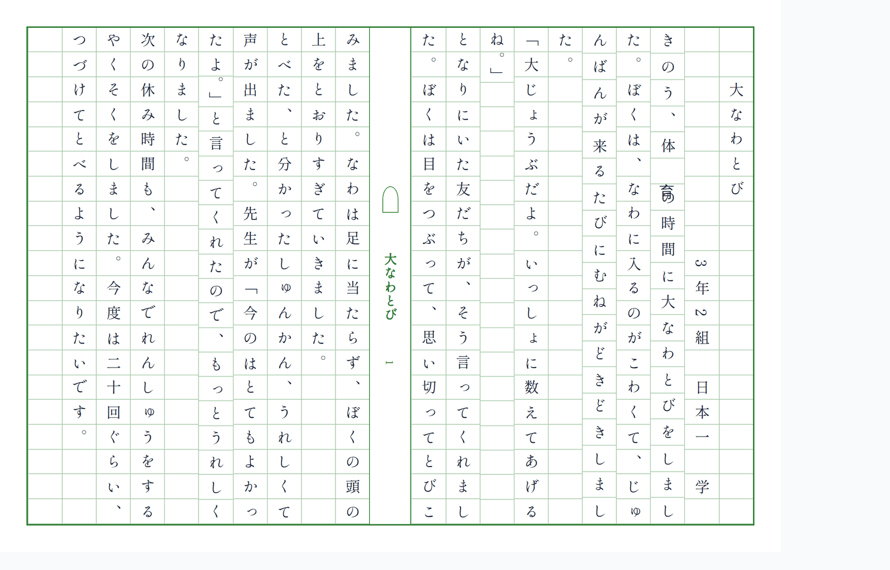

まん<ruby>中<rt>なか</rt></ruby>の <ruby>線<rt>せん</rt></ruby>に <ruby>題名<rt>だいめい</rt></ruby>と ページ<ruby>番号<rt>ばんごう</rt></ruby>が <ruby>入<rt>はい</rt></ruby>ります。

【！】<ruby>覚<rt>おぼ</rt></ruby>えておくこと:

- <ruby>紙<rt>かみ</rt></ruby> 1 <ruby>枚<rt>まい</rt></ruby>に、<ruby>見開<rt>みひら</rt></ruby>き 2 <ruby>面<rt>めん</rt></ruby>の <ruby>原稿用紙<rt>げんこうようし</rt></ruby>が ならびます
- まん<ruby>中<rt>なか</rt></ruby>の <ruby>行<rt>ぎょう</rt></ruby>のあいだには、<ruby>題名<rt>だいめい</rt></ruby>の さいしょの 10 <ruby>文字<rt>もじ</rt></ruby>と ページ<ruby>番号<rt>ばんごう</rt></ruby>が <ruby>入<rt>はい</rt></ruby>ります
- <ruby>画面<rt>がめん</rt></ruby>の <ruby>赤<rt>あか</rt></ruby>ペンや コメントは <ruby>刷<rt>す</rt></ruby>られません。<ruby>刷<rt>す</rt></ruby>られるのは <ruby>作文<rt>さくぶん</rt></ruby>そのものだけです
- <ruby>設定<rt>せってい</rt></ruby>で えらんだ マスの <ruby>数<rt>かず</rt></ruby>が そのまま つかわれます

## ホーム<ruby>画面<rt>がめん</rt></ruby>に <ruby>入<rt>い</rt></ruby>れて、ネットが なくても つかう

この アプリは、ホーム<ruby>画面<rt>がめん</rt></ruby>に <ruby>置<rt>お</rt></ruby>いて ふつうの アプリのように <ruby>開<rt>ひら</rt></ruby>けます。<ruby>入<rt>い</rt></ruby>れると、アドレスの らんが <ruby>消<rt>き</rt></ruby>えて <ruby>画面<rt>がめん</rt></ruby>が <ruby>広<rt>ひろ</rt></ruby>く つかえ、<ruby>一度<rt>いちど</rt></ruby> <ruby>開<rt>ひら</rt></ruby>いたあとなら インターネットに つながっていなくても <ruby>立<rt>た</rt></ruby>ち<ruby>上<rt>あ</rt></ruby>がります。<ruby>入<rt>い</rt></ruby>れても、<ruby>作文<rt>さくぶん</rt></ruby>が どこかへ <ruby>送<rt>おく</rt></ruby>られる ことは ありません。

### 「<ruby>追加<rt>ついか</rt></ruby>」の ボタンで ホーム<ruby>画面<rt>がめん</rt></ruby>に <ruby>入<rt>い</rt></ruby>れる

Chromebook や Windows の パソコン（Chrome・Edge）では、<ruby>画面<rt>がめん</rt></ruby>の <ruby>上<rt>うえ</rt></ruby>に <ruby>緑色<rt>みどりいろ</rt></ruby>の「<ruby>追加<rt>ついか</rt></ruby>」の ボタンが <ruby>出<rt>で</rt></ruby>ます。おして、そのあとに <ruby>出<rt>で</rt></ruby>る「インストール」を おせば おわりです。

すでに <ruby>入<rt>い</rt></ruby>れてある ときや、その ブラウザが <ruby>対応<rt>たいおう</rt></ruby>して いない ときは、この ボタンは <ruby>出<rt>で</rt></ruby>ません。アドレスの らんの <ruby>右<rt>みぎ</rt></ruby>はしに ある インストールの しるしからでも おなじ ことが できます。

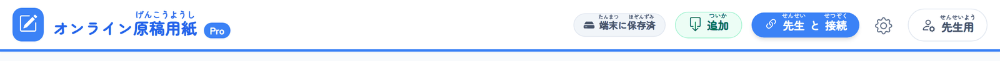

<ruby>緑色<rt>みどりいろ</rt></ruby>の「<ruby>追加<rt>ついか</rt></ruby>」が その ボタンです。

### iPad・iPhone（Safari）で <ruby>入<rt>い</rt></ruby>れる とき

Safari には「インストール」の しくみが ないので、<ruby>自分<rt>じぶん</rt></ruby>で <ruby>入<rt>い</rt></ruby>れます。アプリの「<ruby>追加<rt>ついか</rt></ruby>」を おすと、<ruby>下<rt>した</rt></ruby>の <ruby>手順<rt>てじゅん</rt></ruby>が <ruby>画面<rt>がめん</rt></ruby>にも <ruby>出<rt>で</rt></ruby>ます。

<ruby>追加<rt>ついか</rt></ruby>の <ruby>手順<rt>てじゅん</rt></ruby>:

1. Safari で アプリを <ruby>開<rt>ひら</rt></ruby>いてください。
2. <ruby>画面<rt>がめん</rt></ruby>の <ruby>下<rt>した</rt></ruby>（iPad では <ruby>上<rt>うえ</rt></ruby>）に ある <ruby>共有<rt>きょうゆう</rt></ruby>の しるし（<ruby>四角<rt>しかく</rt></ruby>から <ruby>上<rt>うえ</rt></ruby>むきの <ruby>矢印<rt>やじるし</rt></ruby>）を おしてください。
3. メニューを <ruby>下<rt>した</rt></ruby>へ おくって「ホーム<ruby>画面<rt>がめん</rt></ruby>に<ruby>追加<rt>ついか</rt></ruby>」を えらんでください。
4. <ruby>右上<rt>みぎうえ</rt></ruby>の「<ruby>追加<rt>ついか</rt></ruby>」を おしてください。

【！】<ruby>覚<rt>おぼ</rt></ruby>えておくこと:

- iPad の Chrome アプリの <ruby>中<rt>なか</rt></ruby>からは <ruby>追加<rt>ついか</rt></ruby>できません。Safari で <ruby>開<rt>ひら</rt></ruby>き<ruby>直<rt>なお</rt></ruby>してから やってください
- <ruby>入<rt>い</rt></ruby>れなくても、ブラウザで <ruby>開<rt>ひら</rt></ruby>くだけで すべての <ruby>機能<rt>きのう</rt></ruby>が つかえます
- <ruby>入<rt>い</rt></ruby>れておくと、iPad で しばらく つかわない ときに データが <ruby>消<rt>き</rt></ruby>えにくく なります

### <ruby>黒<rt>くろ</rt></ruby>い <ruby>帯<rt>おび</rt></ruby>が <ruby>出<rt>で</rt></ruby>たら「さいしんに する」を おす

アプリが <ruby>新<rt>あたら</rt></ruby>しく なると、<ruby>画面<rt>がめん</rt></ruby>の <ruby>下<rt>した</rt></ruby>に <ruby>黒<rt>くろ</rt></ruby>い <ruby>帯<rt>おび</rt></ruby>で「あたらしい バージョンが あります」と <ruby>出<rt>で</rt></ruby>ます。「さいしんに する」を おすと、<ruby>新<rt>あたら</rt></ruby>しい ものに かわります。いま <ruby>書<rt>か</rt></ruby>いている <ruby>作文<rt>さくぶん</rt></ruby>は <ruby>自動<rt>じどう</rt></ruby>で <ruby>保存<rt>ほぞん</rt></ruby>されて いるので、おしても <ruby>消<rt>き</rt></ruby>えません。

いま かえたくない ときは、<ruby>右<rt>みぎ</rt></ruby>はしの × で <ruby>閉<rt>と</rt></ruby>じられます。<ruby>次<rt>つぎ</rt></ruby>に <ruby>開<rt>ひら</rt></ruby>いた ときに また <ruby>出<rt>で</rt></ruby>ます。

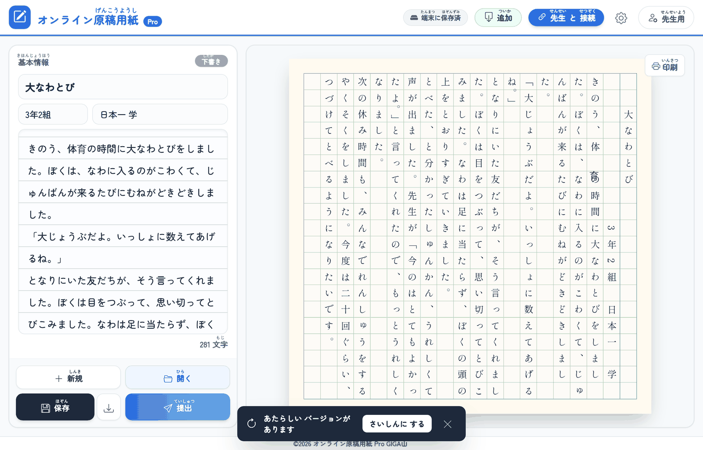

<ruby>画面<rt>がめん</rt></ruby>の <ruby>下<rt>した</rt></ruby>に <ruby>出<rt>で</rt></ruby>ます。

## 通信ルームを開き、あいことばを児童に伝える（先生向け）

ここから先の章は、先生だけが使う画面の説明です。児童のみなさんは、ここを読まなくてもかまいません。

児童から作文を受け取るには、先生の端末で「通信ルーム」を開きます。ルームは先生のタブが開いているあいだだけ動きます。

### 先生モードに入る

画面右上の「先生用」を押してください。パスワードを決めていなければ、そのまま先生モードに切り替わり、ヘッダーの下線が青から赤に変わります。パスワードを決めてある場合は、ログイン画面が出ます。

左側が名簿、右側が選んだ児童の作文です。まだ誰も提出していないので、この時点では名簿は空で、右側には「リストから作品を選択してください」と出ます。

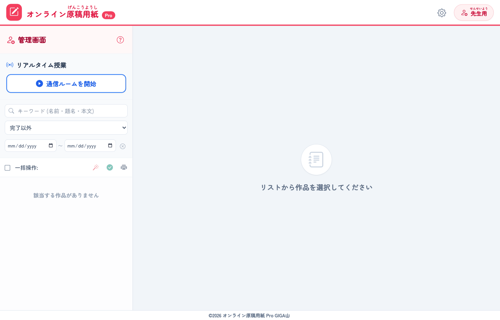

左上が「管理画面」に変わります。

### 通信ルームを開始して、あいことばを児童に伝える

左パネルの「通信ルームを開始」を押してください。10文字のあいことばが大きく表示されるので、そのまま黒板や大型提示装置に書き写して、児童に伝えます。

児童は自分の画面の「先生と接続」からこれを入力します。大文字と小文字はどちらでも通り、まん中の「-」も入れなくてかまいません。見まちがえやすい 0 と O、1 と I と L は最初から使っていないので、書き写しでつまずくことはありません。

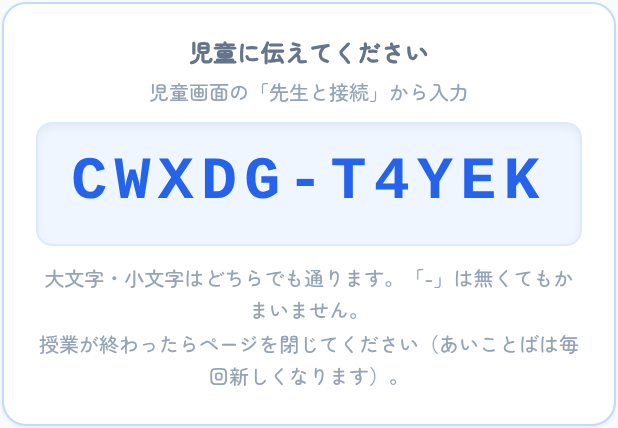

児童の画面の「先生と接続」から入力してもらいます。

ルームが動いているあいだ、「リアルタイム授業」の右に「◯人 接続中」と出ます。ここが増えないときは、児童があいことばを入れられていないか、学校のネットワークが通信をさえぎっている可能性があります。

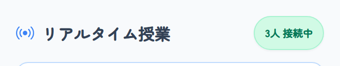

つながっている児童の人数です。

【！】覚えておいていただきたいこと:

- あいことばは10文字なので、他の教室と重なることはまず起きません。万一重なった場合は自動で取り直します
- 通信ルームは、先生が児童モードに切り替えても続きます。ページを再読み込みすると切れるので、授業中はタブを閉じたり更新したりしないでください
- 授業が終わってページを閉じれば、そのあいことばは使われなくなります。次の授業では新しいあいことばになります
- 「通信サーバーに接続できませんでした」と出たときは、インターネット接続を確かめて、もう一度押してください

## 名簿から児童の作文をさがす（先生向け）

左パネルが名簿です。提出された作文がここに並び、選ぶと右側に原稿用紙が出ます。

### 名簿に並ぶのは「提出済」になってから

名簿に並ぶのは、児童が「提出」を押した作文だけです。書いている途中の下書きは並びません。並び順は、更新のあたらしいものが上です。

それぞれの行には、児童の名前、状態の色（青が提出済、オレンジが再提出、緑が完了）、題名が出ます。前回の添削のときから本文が変わっている作文には、青い差分のしるしが付きます。

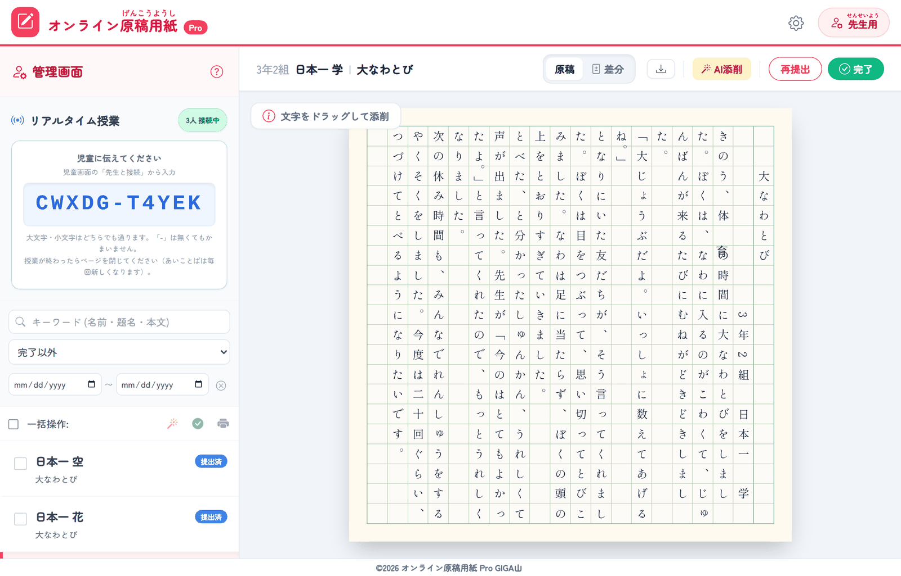

行を押すと、右側にその作文が出ます。

【！】覚えておいていただきたいこと:

- 名簿に出ないだけで、児童が接続しているあいだの本文は先生の端末にも届いて保存されています。「書いている途中は先生には見えない」と児童に説明すると、事実と違います
- 受け取ったデータを消したいときは、先生用設定の「全データを消去する」を使ってください
- 児童が接続していないあいだの下書きは、先生の端末には届きません

### キーワード・状態・日付でしぼり込む

名簿の上に、しぼり込みのための欄が3つあります。

- キーワード … 名前・題名・本文から探します
- 状態 … 「完了以外」が最初の値です。「すべて表示」「提出済」「再提出」「完了」に切り替えられます
- 日付（2つの欄） … 更新日の範囲でしぼります。先生が添削や状態変更をした日時も反映されます

右はしの × を押すと、しぼり込みをすべて解除して最初の状態に戻せます。

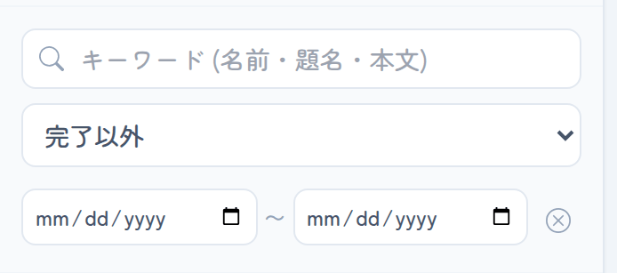

上からキーワード、状態、日付の範囲です。

### 画面のせまい端末では、名簿と作文が切り替わる

タブレットを縦にして使うときなど、画面がせまい端末では、名簿と作文が同時には出ません。名簿で児童を押すと作文の画面に切り替わり、左上の「＜」を押すと名簿に戻ります。

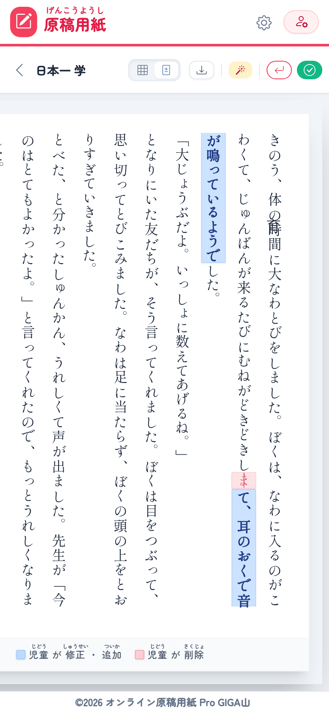

左上の「＜」で名簿に戻ります。

## 原稿用紙をなぞって赤ペンを入れる（先生向け）

添削は、原稿用紙の上を直接なぞって行います。マウスでもタブレットの指でもできます。付けた赤ペンは、接続している児童の画面にはその場で届きます。

### 直したい文字をドラッグして選ぶ

名簿から児童を選ぶと、右側に原稿用紙が出ます。画面の左上に「文字をドラッグして添削」と案内が出ていれば、なぞれる状態です。

直したい文字の上でマウスの左ボタンを押したまま動かすか、タブレットなら指でなぞってください。選んでいるあいだ、そのマスは黄色くなります。

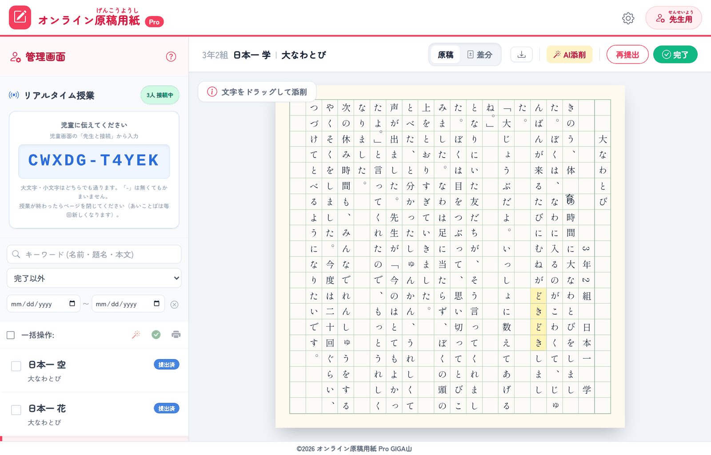

黄色いところが、いま選んでいる範囲です。

【！】覚えておいていただきたいこと:

- タブレットでは、横方向のスワイプはページ送り、縦方向のドラッグが添削の範囲選択になります
- 1文字だけを指定したいときも、その文字の上で軽くドラッグしてください
- 原稿用紙を横に送ると、あとのページにも同じようになぞれます

### コメントを書いて「追加する」を押す

指を離す（またはマウスのボタンを離す）と、コメントを書く画面が開きます。修正の指示やアドバイスを入れて「追加する」を押してください。何も書かないと「追加する」は押せません。

やめたいときは、右上の × か、画面の外を押せば閉じます。

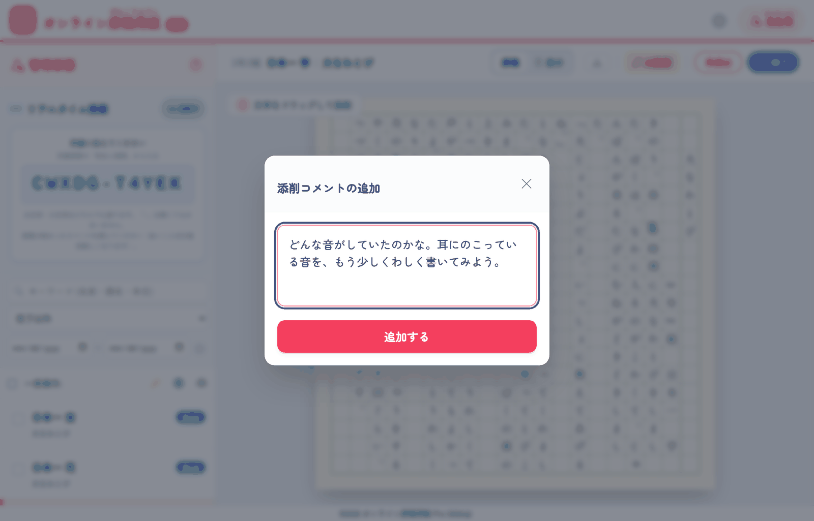

書き終えたら赤い「追加する」を押します。

### 付いた赤ペンの見え方と、児童への届き方

追加すると、なぞった範囲がうすい赤の背景と赤い縦線で表示され、「添削を保存しました」と小さく出ます。接続中の児童には、その場で同じものが届きます。接続していない児童には、次につないだときに自動で返却されます。

児童が「修正完了」にした添削は、先生の画面では緑色に変わります。児童の画面からは消えているので、色が変わったところは「もう直した」という意味になります。

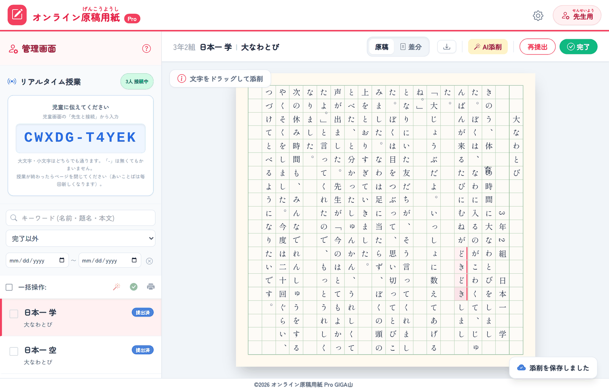

うすい赤とたての赤い線が添削したところです。

【！】覚えておいていただきたいこと:

- いちど付けた赤ペンを取り消す方法は、いまの版にはありません。まちがえて付けたときは、同じところにもう一度なぞって「ここは直さなくてよいです」のように書き足してください
- 児童が本文を書き直しても、添削の位置は文字のずれに合わせて自動で追いかけます
- 添削は何個でも付けられます。1つの作文の中で、離れた場所にいくつも置けます

## AI添削で下ごしらえをする（先生向け）

Gemini の API キーを登録すると、誤字脱字の指摘と、児童の考えを引き出す問いかけを、AI が赤ペンとして貼り付けます。あくまで下ごしらえで、そのあと先生が手を入れることを前提にしています。使わなくても、このアプリのほかの機能はすべて使えます。

### 使う前に Gemini API キーを登録する

キーを登録していない状態で「AI添削」を押すと、「先生用設定からGemini APIキーを登録してください。（タブを閉じると消えます）」と出ます。先生モードの歯車から登録してください（登録のしかたは、このあとの「先生用設定」の章にあります）。

キーはこのタブを閉じるまでしか覚えません。共用の端末にキーを残さないための作りなので、翌日また開いたときは入れ直してください。

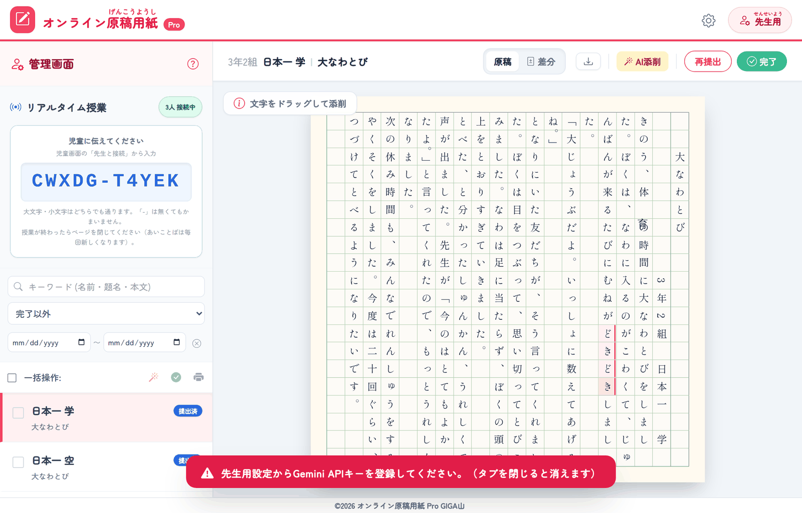

画面の下に赤い帯で出ます。

### 1人分と、まとめての2つのやり方

- 1人分 … 作文を選んだ状態で、画面右上の「AI添削」を押します。キーボードの A でも同じです
- まとめて … 名簿でチェックを入れてから、一括操作のつえのしるしを押します。Shift + A でも同じです。実行前に確認の画面が出ます

処理が終わると「◯件のAI提案を追加しました」と出ます。貼り付いたものは、先生が手で付けた添削とまったく同じように扱えます。接続中の児童にはその場で届きます。

【！】覚えておいていただきたいこと:

- AI に送られるのは「学年・クラス」「題名」「本文」だけです。児童の名前は送っていません
- AI が指摘した文字列が本文の中に見つからなかった場合、その提案は貼り付けられません。件数が思ったより少ないときは、これが理由です
- まとめての添削は1件ずつ順に処理します。キーが正しくないときは途中で中断し、成功と失敗の件数を知らせます
- AI の指摘をそのまま返さず、先生が読んでから返すことをおすすめします

## 直したところを差分で見て、再提出・完了にする（先生向け）

添削したあとは、児童に返します。返し方は「再提出」と「完了」の2つで、どちらも接続中の児童の画面にすぐ反映されます。

### 作文の上にならぶボタン

作文を選ぶと、その上に操作のボタンが横に並びます。左から順に、次のものです。

- 「原稿」「差分」… 表示の切り替えです。キーボードの V でも切り替わります
- 下向きの矢印 … いま開いている作文を、添削込みのファイルとして書き出します
- 「AI添削」… この作文だけを AI に添削させます
- 「再提出」… 児童にもう一度書かせます。キーボードの R でも同じです
- 「完了」… これで完成にします。キーボードの C でも同じです

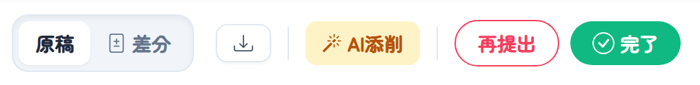

いちばん右の緑が「完了」です。

### 差分ビューで、児童が書き足したところを見る

「差分」に切り替えると、前回添削した時点からどこが変わったかが色で分かります。青い背景が書き足した(または書き換えた)ところ、赤い取り消し線が消したところです。

児童が本文を直していた作文は、選んだときに自動で差分ビューで開きます。どこを直したのかを探さなくてよいようにするためです。

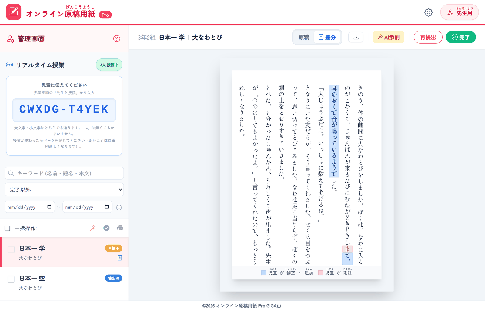

青が書き足し、赤い取り消し線が削除です。

### 「再提出」で返す、「完了」で終わりにする

「再提出」を押すと、その作文は児童の画面でふたたび編集できるようになり、名簿ではオレンジ色に変わります。「完了」を押すと、児童の画面では編集できなくなり、名簿では緑色に変わります。

どちらを押しても、接続していない児童には次につないだときに届きます。押しまちがえたときは、もう一方を押せば戻せます。

【！】覚えておいていただきたいこと:

- 「完了」にしたあとでも「再提出」を押せば、児童はまた書けるようになります
- 児童が「完了」の作文を書き直したいときは、児童の画面で「コピーして新しく書く」を使ってもらってください
- 状態を変えると、名簿の並び順（更新のあたらしい順）も変わります

## チェックを入れて、まとめてAI添削・完了・印刷する（先生向け）

40人分を1人ずつ操作すると時間がかかります。名簿のチェックボックスで選んでおけば、まとめて処理できます。

### 一括操作のならびと、対象の選び方

名簿の上に「一括操作:」の行があります。左はしの四角が「表示中の作品をすべて選択」で、右に3つのしるしが並びます。

- つえのしるし … まとめてAI添削します（Shift + A）
- 緑のチェック … まとめて「完了」にします
- プリンタ … まとめて印刷します（Shift + P）

1人ずつ選びたいときは、名簿の各行の左にある四角を押してください。チェックを1つも入れていないと、3つのしるしは押せません。

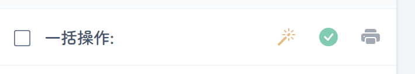

左はしの四角で、表示中をまとめて選べます。

### まとめて「完了」にする

チェックを入れてから緑のチェックのしるしを押すと、「選択した ◯ 件を「完了」にしますか？」と確認が出ます。「完了にする」を押すと、選んだ作文がすべて完了になり、接続中の児童の画面にもすぐ反映されます。

処理が終わるとチェックは外れます。まちがえたときは、1人ずつ選んで「再提出」に戻してください。

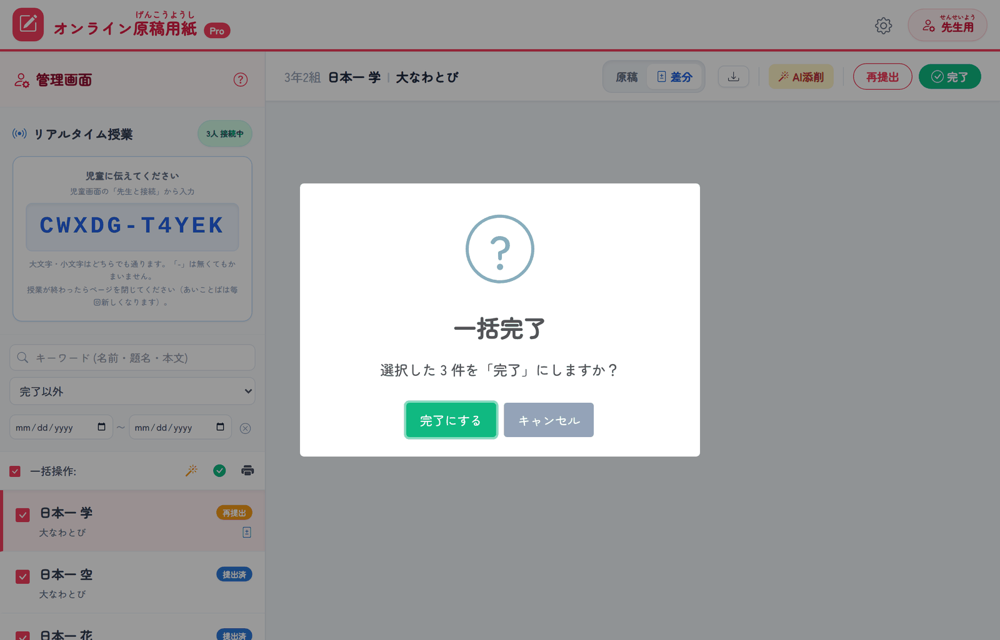

件数を確かめてから押してください。

【！】覚えておいていただきたいこと:

- しぼり込みをしてから「表示中の作品をすべて選択」を押すと、しぼり込んだぶんだけを選べます
- まとめてのAI添削も、実行前に件数の確認が出ます
- まとめての印刷には確認がありません。押すとすぐブラウザの印刷画面になります
- 印刷の用紙の設定（A4・横・余白なし・背景のグラフィックあり）は、1人分のときと同じです

## キーボードショートカットで手早く回す（先生向け）

先生モードでは、入力欄にカーソルが無いときにキーボードだけで操作できます。40人分を順に見ていくときは、こちらのほうが速く回せます。

いつでも ? キーを押せば、次の一覧が画面に出ます。もう一度 ? を押すか、Esc キーで閉じられます。

- ↑ / ↓ … 名簿の中で、前の児童・次の児童に移ります
- V … 表示を「原稿」と「差分」で切り替えます
- S … 表示中の作品をまとめて選ぶ、または選択を解除します
- A … いま開いている作文をAI添削します
- Shift + A … チェックを入れた作品をまとめてAI添削します
- P … いま開いている作文を印刷します
- Shift + P … チェックを入れた作品をまとめて印刷します
- C … いま開いている作文を「完了」にします
- R … いま開いている作文を「再提出」にします
- ? … このショートカット一覧を出す、または閉じます
- Esc … 開いているダイアログを閉じます

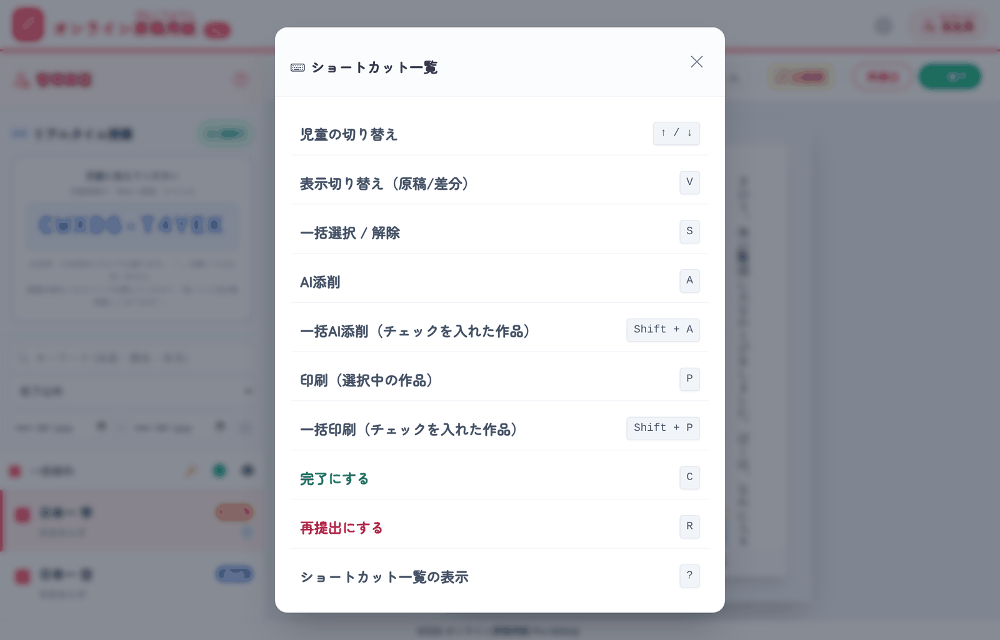

? キーでいつでも出せます。

ダイアログを開いているあいだは、背後の作文が動かないよう、これらのキーは効きません。閉じてから押してください。

## 先生用設定 ― パスワード・APIキー・データの消去（先生向け）

先生モードで歯車を押すと「先生用設定」が開きます。この画面は児童モードでは出ません。用紙のマス目や禁則処理はここにはないので、変えたいときは児童モードに戻ってから歯車を押してください。

### 【重要】児童に配る前にパスワードを決める

最初の状態では、パスワードなしで誰でも先生モードに入れます。児童が使う端末に配る前に、必ずパスワードを決めてください。決めると、次からは「先生用」を押したときにログイン画面が出ます。

パスワードそのものは端末に残しません（元に戻せない形にして保存します）。そのため設定画面には現在のパスワードが表示されず、「変えるときだけ入力する」欄になっています。忘れたときは「パスワードをなくす」で一度消してから決め直してください。

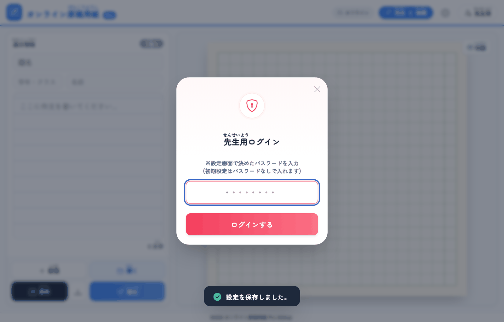

パスワードを決めると、この画面が出ます。

### Gemini APIキーを登録する

「Gemini APIキー (AI添削用)」の欄にキーを貼り付けて、いちばん下の「保存して閉じる」を押してください。これでAI添削が使えるようになります。

キーはこのタブを閉じるまでしか覚えません。端末には残らないので、共用の端末でも次に使う人に読まれることはありません。その代わり、翌日また開いたときは入れ直しが必要です。

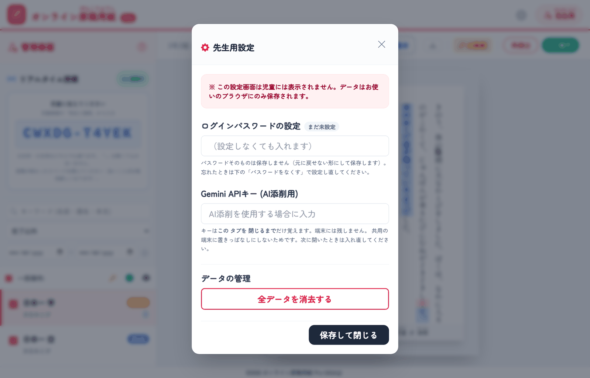

上からパスワード、APIキー、データの管理です。

### 【！！】この端末の提出データをすべて消す

「全データを消去する」を押すと、この端末に届いている児童の提出データがすべて消えます。確認の画面が出ますが、消したあとに元へ戻すことはできません。学年の終わりや、端末を別の学級へ渡すときにお使いください。

消える前に、残しておきたい作文は印刷するか、ファイルとして書き出しておいてください。

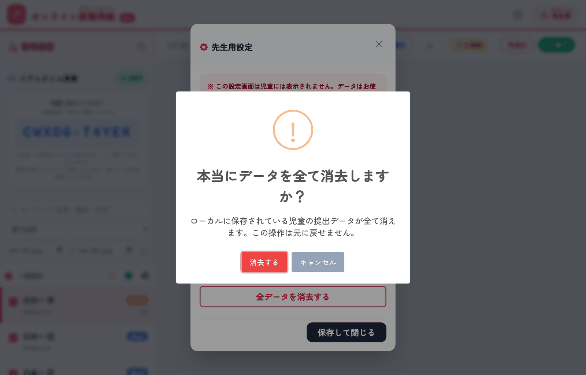

この操作は元に戻せません。

【！！】最重要注意事項:

- 消えるのは先生の名簿のデータだけです。同じ端末の児童モードで書いた作文、用紙の設定、先生モードのパスワードは残ります
- 名簿に出ていない、児童が提出前に送ってきた下書きも、あわせて消えます
- 児童の端末にある作文は消えません。消えるのは、この端末に届いたぶんだけです

## <ruby>通信<rt>つうしん</rt></ruby>が つかえない ときに、ファイルで <ruby>作文<rt>さくぶん</rt></ruby>を やりとりする

<ruby>学校<rt>がっこう</rt></ruby>の ネットワークの ぐあいで 先生と つながらない ときでも、<ruby>作文<rt>さくぶん</rt></ruby>を ファイルに して わたせます。<ruby>読<rt>よ</rt></ruby>みこめるのは、この アプリが <ruby>書<rt>か</rt></ruby>き<ruby>出<rt>だ</rt></ruby>した ファイルだけです。

### <ruby>作文<rt>さくぶん</rt></ruby>を ファイルに <ruby>書<rt>か</rt></ruby>き<ruby>出<rt>だ</rt></ruby>す・もらった ファイルを <ruby>開<rt>ひら</rt></ruby>く

ボタンの まん<ruby>中<rt>なか</rt></ruby>に ある <ruby>下<rt>した</rt></ruby>むきの <ruby>矢印<rt>やじるし</rt></ruby>を おすと、いま <ruby>開<rt>ひら</rt></ruby>いている <ruby>作文<rt>さくぶん</rt></ruby>が 1 つの ファイルに なって <ruby>端末<rt>たんまつ</rt></ruby>に <ruby>保存<rt>ほぞん</rt></ruby>されます。ファイルの <ruby>名前<rt>なまえ</rt></ruby>は「<ruby>名前<rt>なまえ</rt></ruby>_<ruby>題名<rt>だいめい</rt></ruby>.json」の かたちに なります。

<ruby>別<rt>べつ</rt></ruby>の <ruby>端末<rt>たんまつ</rt></ruby>で つづきを <ruby>書<rt>か</rt></ruby>きたい ときや、<ruby>大事<rt>だいじ</rt></ruby>な <ruby>作文<rt>さくぶん</rt></ruby>の ひかえを <ruby>取<rt>と</rt></ruby>って おきたい ときに つかいます。

「<ruby>開<rt>ひら</rt></ruby>く」を おして、<ruby>一覧<rt>いちらん</rt></ruby>の いちばん <ruby>下<rt>した</rt></ruby>に ある「ファイルから<ruby>読<rt>よ</rt></ruby>み<ruby>込<rt>こ</rt></ruby>む」を おします。ファイルを えらぶと、その <ruby>作文<rt>さくぶん</rt></ruby>が <ruby>開<rt>ひら</rt></ruby>いて、この <ruby>端末<rt>たんまつ</rt></ruby>にも <ruby>保存<rt>ほぞん</rt></ruby>されます。

<ruby>先生<rt>せんせい</rt></ruby>から もらった <ruby>添削<rt>てんさく</rt></ruby>ずみの ファイルも、おなじ やり<ruby>方<rt>かた</rt></ruby>で <ruby>開<rt>ひら</rt></ruby>けます。<ruby>赤<rt>あか</rt></ruby>い マスも いっしょに <ruby>入<rt>はい</rt></ruby>って きます。

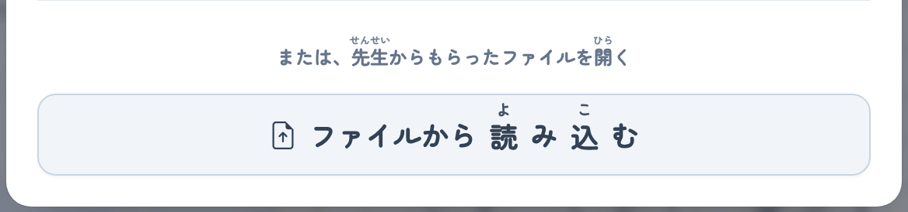

<ruby>一覧<rt>いちらん</rt></ruby>の いちばん <ruby>下<rt>した</rt></ruby>に あります。

【！】<ruby>覚<rt>おぼ</rt></ruby>えておくこと:

- かたちの ちがう ファイルを えらぶと「ファイルの よみこみに しっぱい しました」と <ruby>出<rt>で</rt></ruby>ます
- <ruby>読<rt>よ</rt></ruby>みこんだ <ruby>作文<rt>さくぶん</rt></ruby>は、いつもの「<ruby>開<rt>ひら</rt></ruby>く」の <ruby>一覧<rt>いちらん</rt></ruby>にも ならぶように なります

ファイルの <ruby>中<rt>なか</rt></ruby>には、<ruby>題名<rt>だいめい</rt></ruby>・<ruby>学年<rt>がくねん</rt></ruby>・クラス・<ruby>名前<rt>なまえ</rt></ruby>・<ruby>本文<rt>ほんぶん</rt></ruby>と、<ruby>先生<rt>せんせい</rt></ruby>の <ruby>赤<rt>あか</rt></ruby>ペンが <ruby>入<rt>はい</rt></ruby>って います。<ruby>写真<rt>しゃしん</rt></ruby>や <ruby>音<rt>おと</rt></ruby>は <ruby>入<rt>はい</rt></ruby>りません。

### 添削したものをファイルで児童に渡す（先生向け）

先生モードで作文を選び、上に並ぶ下向きの矢印を押すと、添削込みのファイルとして書き出せます。ファイルの名前は「名前_添削済.json」になります。

このファイルを共有フォルダなどで児童に渡し、児童の画面の「開く」から「ファイルから読み込む」で取りこんでもらえば、通信が使えない環境でも添削を届けられます。

学級の端末を入れ替えるときや、年度の終わりに作文を残しておきたいときにも同じ手が使えます。1人分ずつの書き出しになるので、まとめて残したいときは印刷のほうが早いこともあります。

【！】覚えておいていただきたいこと:

- 児童が読みこんだファイルは、その端末の「開く」の一覧にも並びます
- 読みこんでも、先生の名簿には自動では届きません。届けるには、児童が接続してから「提出」を押す必要があります
- ファイルの中身は文字だけなので、共有フォルダやメールでそのまま渡せます

## <ruby>作文<rt>さくぶん</rt></ruby>が どこに <ruby>保存<rt>ほぞん</rt></ruby>されるか、いつ <ruby>消<rt>き</rt></ruby>えてしまうか

この アプリは、<ruby>書<rt>か</rt></ruby>いた ものを インターネットの <ruby>先<rt>さき</rt></ruby>へ <ruby>送<rt>おく</rt></ruby>りません。どこに <ruby>入<rt>はい</rt></ruby>っているのかを <ruby>知<rt>し</rt></ruby>っておくと、こまった ときに あわてずに すみます。

### データは この <ruby>端末<rt>たんまつ</rt></ruby>の <ruby>中<rt>なか</rt></ruby>だけに ある

<ruby>作文<rt>さくぶん</rt></ruby>も、<ruby>用紙<rt>ようし</rt></ruby>の <ruby>設定<rt>せってい</rt></ruby>も、いま <ruby>開<rt>ひら</rt></ruby>いている ブラウザの <ruby>中<rt>なか</rt></ruby>に <ruby>保存<rt>ほぞん</rt></ruby>されます。<ruby>学校<rt>がっこう</rt></ruby>の サーバーにも、どこかの <ruby>会社<rt>かいしゃ</rt></ruby>の サーバーにも <ruby>送<rt>おく</rt></ruby>られません。

<ruby>先生<rt>せんせい</rt></ruby>に <ruby>提出<rt>ていしゅつ</rt></ruby>した ときだけ、<ruby>先生<rt>せんせい</rt></ruby>の <ruby>端末<rt>たんまつ</rt></ruby>へ ちょくせつ <ruby>送<rt>おく</rt></ruby>られます。そこでも、<ruby>先生<rt>せんせい</rt></ruby>の ブラウザの <ruby>中<rt>なか</rt></ruby>に とどまります。

### <ruby>消<rt>き</rt></ruby>えてしまうのは こんな とき

<ruby>下<rt>した</rt></ruby>の どれかを すると、<ruby>書<rt>か</rt></ruby>いた ものが <ruby>読<rt>よ</rt></ruby>めなく なります。<ruby>大事<rt>だいじ</rt></ruby>な <ruby>作文<rt>さくぶん</rt></ruby>は、<ruby>先<rt>さき</rt></ruby>に <ruby>印刷<rt>いんさつ</rt></ruby>するか、ファイルに して のこして ください。

- ブラウザの「<ruby>閲覧履歴<rt>えつらんりれき</rt></ruby>・サイトデータの <ruby>削除<rt>さくじょ</rt></ruby>」を した とき
- <ruby>別<rt>べつ</rt></ruby>の <ruby>端末<rt>たんまつ</rt></ruby>や、<ruby>別<rt>べつ</rt></ruby>の ブラウザ、シークレット ウィンドウで <ruby>開<rt>ひら</rt></ruby>いた とき
- <ruby>端末<rt>たんまつ</rt></ruby>を さいしょの <ruby>状態<rt>じょうたい</rt></ruby>に もどした とき
- <ruby>同<rt>おな</rt></ruby>じ <ruby>端末<rt>たんまつ</rt></ruby>で、ほかの <ruby>人<rt>ひと</rt></ruby>の アカウントに <ruby>切<rt>き</rt></ruby>りかえた とき

「この<ruby>端末<rt>たんまつ</rt></ruby>に<ruby>保存<rt>ほぞん</rt></ruby>できませんでした」と <ruby>出<rt>で</rt></ruby>た ときは、<ruby>保存<rt>ほぞん</rt></ruby>できる <ruby>場所<rt>ばしょ</rt></ruby>が いっぱいか、シークレット ウィンドウで <ruby>開<rt>ひら</rt></ruby>いて います。いらない データを <ruby>消<rt>け</rt></ruby>すか、ふつうの ウィンドウで <ruby>開<rt>ひら</rt></ruby>き<ruby>直<rt>なお</rt></ruby>して ください。

### 端末に何が保存されるか（先生向け）

ブラウザの localStorage に保存されるのは、次のものです。いずれも外部には送信されません。

- 先生が受け取った提出データ（名簿の中身）
- 児童が保存した作品と、書きかけの自動保存
- 児童の端末を見分けるための番号（再接続したときに自動で返却するために使います）
- 用紙のマス目と禁則処理の設定
- 返却通知の既読状態
- 先生モードのパスワード（そのままの文字ではなく、元に戻せない形にしたものだけ）

Gemini の API キーだけは、localStorage ではなくタブを閉じると消える場所に置いています。共用の端末にキーを残さないためです。

## うまく いかない とき

こまった ときは、まず この <ruby>章<rt>しょう</rt></ruby>で <ruby>同<rt>おな</rt></ruby>じ <ruby>症状<rt>しょうじょう</rt></ruby>を さがして ください。<ruby>画面<rt>がめん</rt></ruby>に <ruby>出<rt>で</rt></ruby>ている <ruby>言葉<rt>ことば</rt></ruby>を そのまま さがすと <ruby>見<rt>み</rt></ruby>つかります。

### <ruby>先生<rt>せんせい</rt></ruby>と つながらない とき

<ruby>下<rt>した</rt></ruby>のような しらせが <ruby>出<rt>で</rt></ruby>た ときは、<ruby>次<rt>つぎ</rt></ruby>のように して ください。

- 「せんせいが みつかりません」… あいことばの <ruby>打<rt>う</rt></ruby>ちまちがえか、<ruby>先生<rt>せんせい</rt></ruby>が まだ <ruby>通信<rt>つうしん</rt></ruby>ルームを <ruby>始<rt>はじ</rt></ruby>めて いません。<ruby>先生<rt>せんせい</rt></ruby>の <ruby>画面<rt>がめん</rt></ruby>の あいことばを もう <ruby>一度<rt>いちど</rt></ruby> たしかめて ください
- 「せつぞくエラーが はっせい しました」… <ruby>学校<rt>がっこう</rt></ruby>の ネットワークが この <ruby>通信<rt>つうしん</rt></ruby>を とめて いる ことが あります。<ruby>先生<rt>せんせい</rt></ruby>に <ruby>知<rt>し</rt></ruby>らせて ください
- <ruby>先生<rt>せんせい</rt></ruby>の <ruby>画面<rt>がめん</rt></ruby>で「<ruby>通信<rt>つうしん</rt></ruby>サーバーに<ruby>接続<rt>せつぞく</rt></ruby>できませんでした」… インターネットに つながって いるかを たしかめて、もう <ruby>一度<rt>いちど</rt></ruby>「<ruby>通信<rt>つうしん</rt></ruby>ルームを<ruby>開始<rt>かいし</rt></ruby>」を おして ください

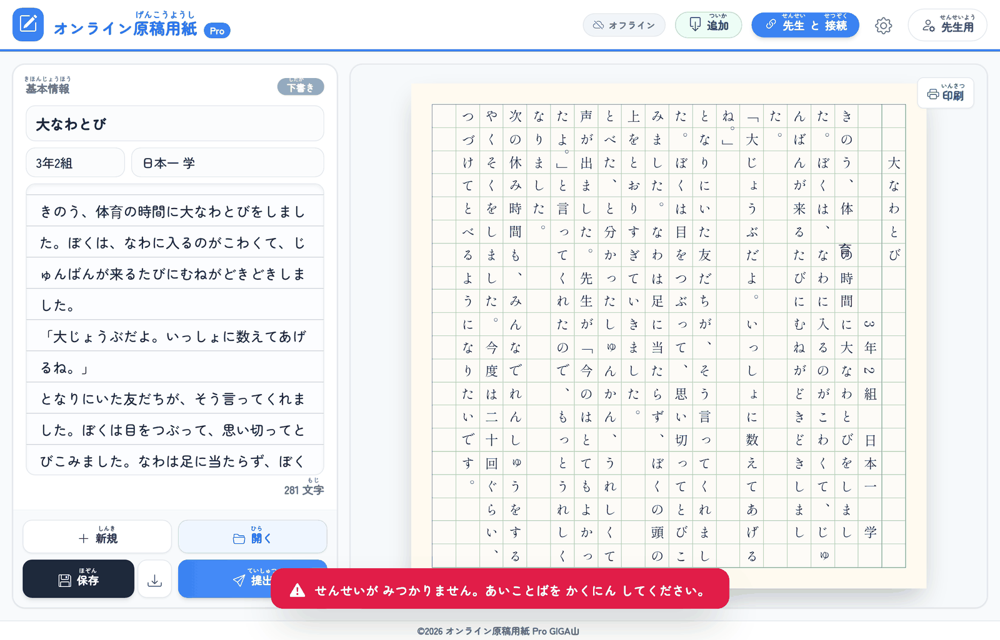

<ruby>画面<rt>がめん</rt></ruby>の <ruby>下<rt>した</rt></ruby>に <ruby>赤<rt>あか</rt></ruby>い <ruby>帯<rt>おび</rt></ruby>で <ruby>出<rt>で</rt></ruby>ます。

### <ruby>提出<rt>ていしゅつ</rt></ruby>できない とき・<ruby>直<rt>なお</rt></ruby>せない とき

- 「なまえを かいてから ていしゅつ してください」… <ruby>名前<rt>なまえ</rt></ruby>の らんが からです。<ruby>入<rt>い</rt></ruby>れてから もう <ruby>一度<rt>いちど</rt></ruby> おして ください
- 「せんせいと せつぞく されていないため ていしゅつ できません」… <ruby>先<rt>さき</rt></ruby>に「<ruby>先生<rt>せんせい</rt></ruby>と<ruby>接続<rt>せつぞく</rt></ruby>」から つないで ください
- 「<ruby>提出済<rt>ていしゅつずみ</rt></ruby>のため<ruby>編集不可<rt>へんしゅうふか</rt></ruby>」… <ruby>先生<rt>せんせい</rt></ruby>が <ruby>見<rt>み</rt></ruby>ている ところです。「<ruby>再提出<rt>さいていしゅつ</rt></ruby>」に して もらうと また <ruby>書<rt>か</rt></ruby>けます
- <ruby>書<rt>か</rt></ruby>いて いるのに <ruby>先生<rt>せんせい</rt></ruby>の <ruby>名簿<rt>めいぼ</rt></ruby>に <ruby>出<rt>で</rt></ruby>てこない… そういう つくりです。<ruby>名簿<rt>めいぼ</rt></ruby>に ならぶのは「<ruby>提出<rt>ていしゅつ</rt></ruby>」を おしてからです
- <ruby>添削<rt>てんさく</rt></ruby>した のに <ruby>児童<rt>じどう</rt></ruby>の <ruby>画面<rt>がめん</rt></ruby>に <ruby>出<rt>で</rt></ruby>ない… その <ruby>児童<rt>じどう</rt></ruby>が <ruby>切<rt>き</rt></ruby>れて います。<ruby>次<rt>つぎ</rt></ruby>に つないだ ときに <ruby>自動<rt>じどう</rt></ruby>で とどきます

### <ruby>画面<rt>がめん</rt></ruby>や <ruby>印刷<rt>いんさつ</rt></ruby>が おもった とおりに ならない とき

- <ruby>印刷<rt>いんさつ</rt></ruby>すると <ruby>線<rt>せん</rt></ruby>が <ruby>出<rt>で</rt></ruby>ない、2 <ruby>枚<rt>まい</rt></ruby>に <ruby>分<rt>わ</rt></ruby>かれる… ブラウザの <ruby>設定<rt>せってい</rt></ruby>を A4・<ruby>横<rt>よこ</rt></ruby>・<ruby>余白<rt>よはく</rt></ruby>なし・<ruby>背景<rt>はいけい</rt></ruby>の グラフィックあり に して ください
- <ruby>用紙<rt>ようし</rt></ruby>の マスの <ruby>数<rt>かず</rt></ruby>を かえたい のに <ruby>設定<rt>せってい</rt></ruby>に ない… <ruby>先生<rt>せんせい</rt></ruby>モードの <ruby>歯車<rt>はぐるま</rt></ruby>は「<ruby>先生用<rt>せんせいよう</rt></ruby><ruby>設定<rt>せってい</rt></ruby>」です。<ruby>児童<rt>じどう</rt></ruby>モードに もどってから <ruby>歯車<rt>はぐるま</rt></ruby>を おして ください
- 「<ruby>追加<rt>ついか</rt></ruby>」の ボタンが <ruby>出<rt>で</rt></ruby>てこない… すでに <ruby>入<rt>い</rt></ruby>れて あるか、その ブラウザが <ruby>対応<rt>たいおう</rt></ruby>して いません。iPad の Safari では いつでも <ruby>出<rt>で</rt></ruby>ます
- <ruby>直<rt>なお</rt></ruby>した はずなのに <ruby>古<rt>ふる</rt></ruby>い <ruby>画面<rt>がめん</rt></ruby>が <ruby>出<rt>で</rt></ruby>る… <ruby>黒<rt>くろ</rt></ruby>い <ruby>帯<rt>おび</rt></ruby>の「さいしんに する」を おすか、アプリを <ruby>一度<rt>いちど</rt></ruby> <ruby>閉<rt>と</rt></ruby>じて <ruby>開<rt>ひら</rt></ruby>き<ruby>直<rt>なお</rt></ruby>して ください
- <ruby>先生<rt>せんせい</rt></ruby>の <ruby>画面<rt>がめん</rt></ruby>で AI <ruby>添削<rt>てんさく</rt></ruby>の <ruby>提案<rt>ていあん</rt></ruby>が <ruby>少<rt>すく</rt></ruby>ない… AI が <ruby>指摘<rt>してき</rt></ruby>した <ruby>文字<rt>もじ</rt></ruby>が <ruby>本文<rt>ほんぶん</rt></ruby>に <ruby>見<rt>み</rt></ruby>つからなかった ぶんは <ruby>付<rt>つ</rt></ruby>きません。<ruby>手<rt>て</rt></ruby>で おぎなって ください
- <ruby>前<rt>まえ</rt></ruby>に <ruby>書<rt>か</rt></ruby>いた <ruby>作文<rt>さくぶん</rt></ruby>が <ruby>消<rt>き</rt></ruby>えた… <ruby>別<rt>べつ</rt></ruby>の <ruby>端末<rt>たんまつ</rt></ruby>や <ruby>別<rt>べつ</rt></ruby>の ブラウザで <ruby>開<rt>ひら</rt></ruby>いて いないか たしかめて ください

### それでも なおらない ときは

まず、この アプリを <ruby>教<rt>おし</rt></ruby>えてくれた <ruby>先生<rt>せんせい</rt></ruby>や、<ruby>学校<rt>がっこう</rt></ruby>の <ruby>情報<rt>じょうほう</rt></ruby>の <ruby>係<rt>かかり</rt></ruby>の <ruby>先生<rt>せんせい</rt></ruby>に きいて ください。<ruby>同<rt>おな</rt></ruby>じ <ruby>端末<rt>たんまつ</rt></ruby>と <ruby>同<rt>おな</rt></ruby>じ ネットワークを <ruby>知<rt>し</rt></ruby>っている <ruby>人<rt>ひと</rt></ruby>が、いちばん <ruby>早<rt>はや</rt></ruby>く <ruby>解決<rt>かいけつ</rt></ruby>できます。

それでも <ruby>分<rt>わ</rt></ruby>からない ときは、この ページの いちばん <ruby>下<rt>した</rt></ruby>に ある <ruby>問<rt>と</rt></ruby>い<ruby>合<rt>あ</rt></ruby>わせ<ruby>先<rt>さき</rt></ruby>から <ruby>知<rt>し</rt></ruby>らせて ください。その ときは、どの <ruby>端末<rt>たんまつ</rt></ruby>で、どの ボタンを おしたら、<ruby>画面<rt>がめん</rt></ruby>に <ruby>何<rt>なに</rt></ruby>と <ruby>出<rt>で</rt></ruby>たかを つけて もらえると <ruby>助<rt>たす</rt></ruby>かります。
